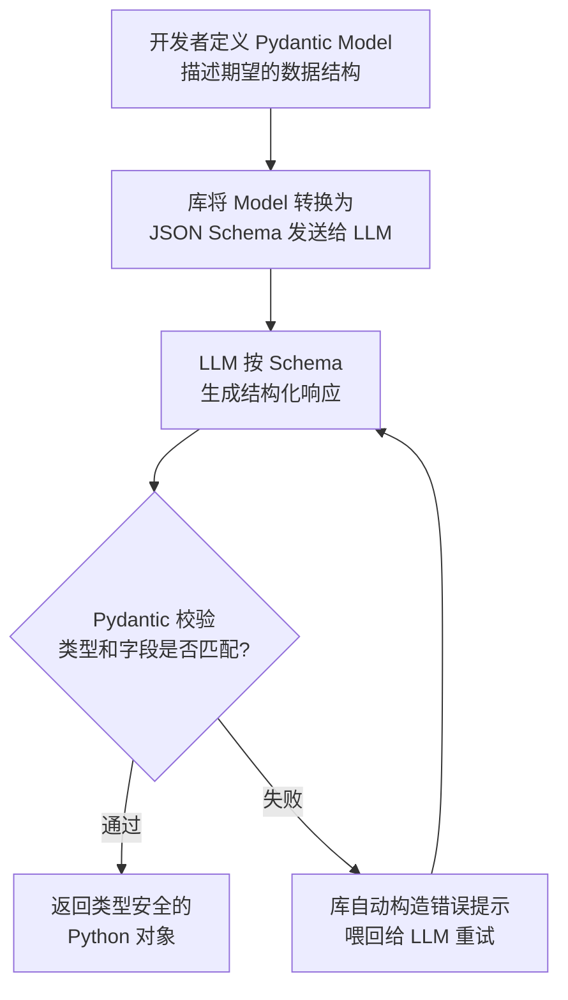
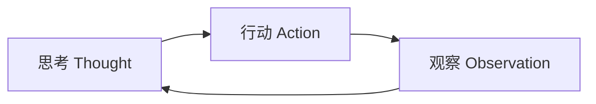
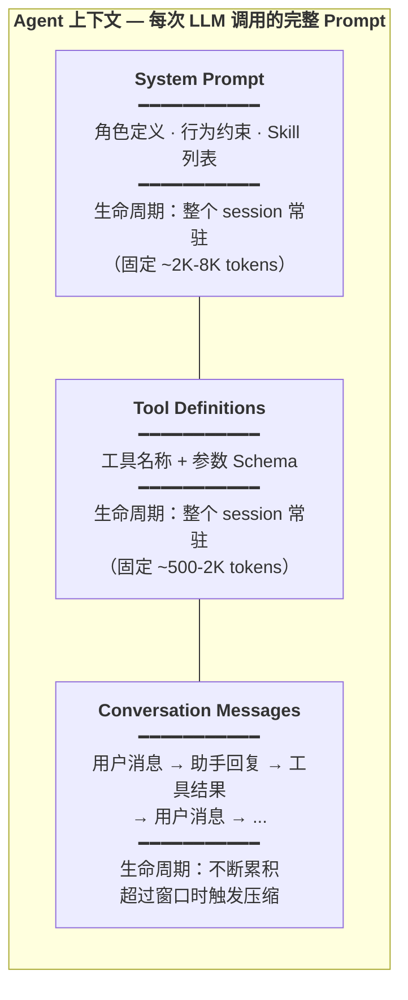
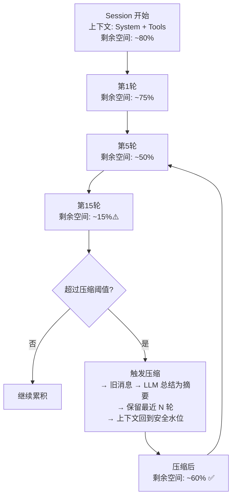
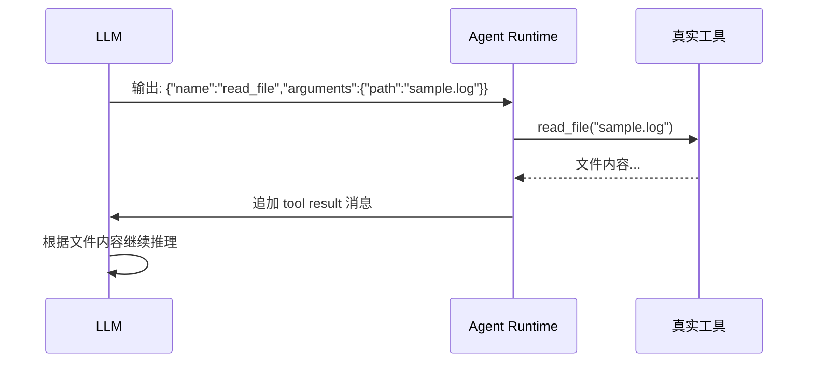
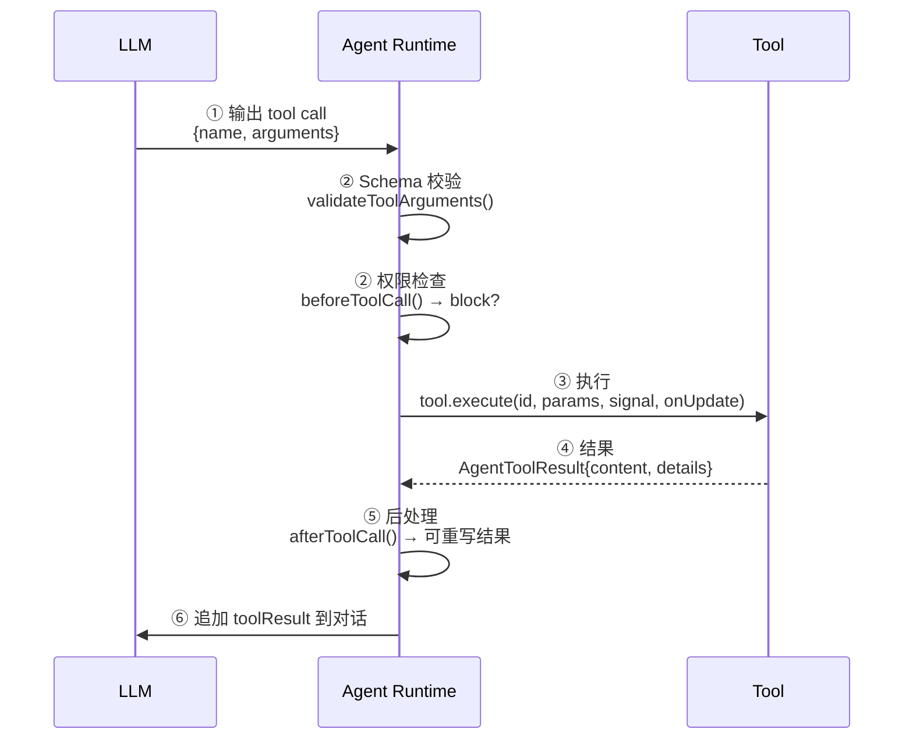
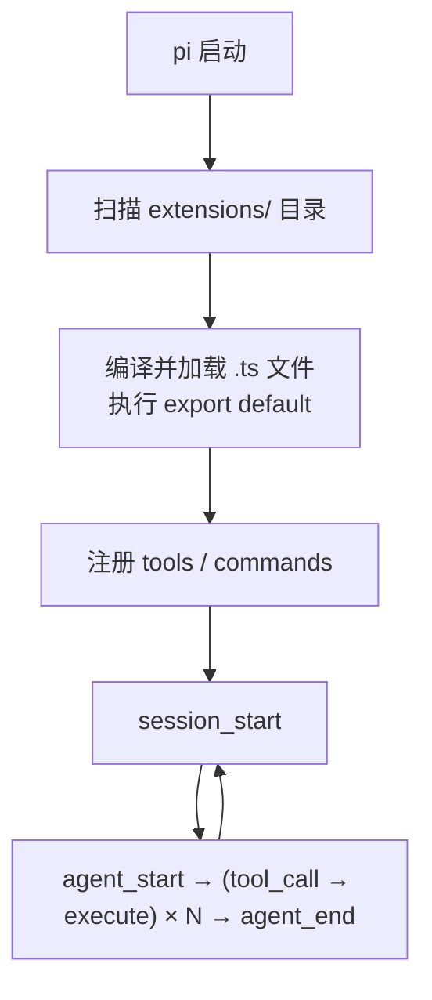
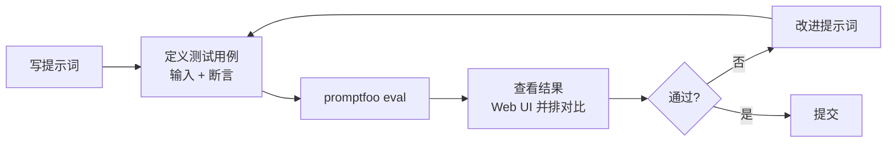
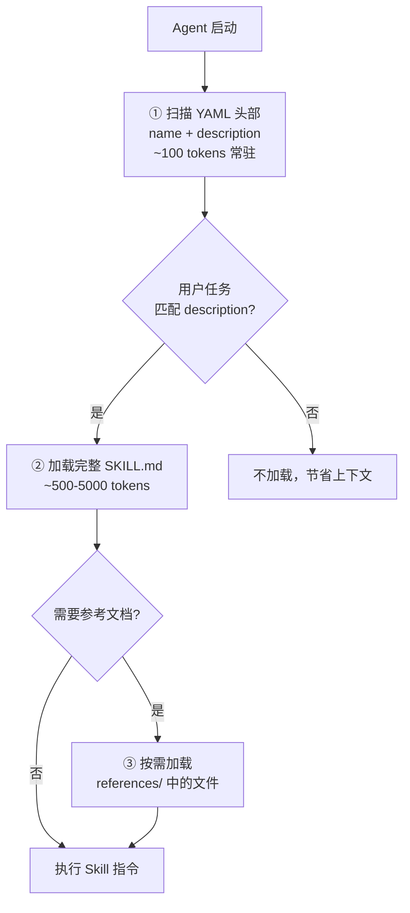
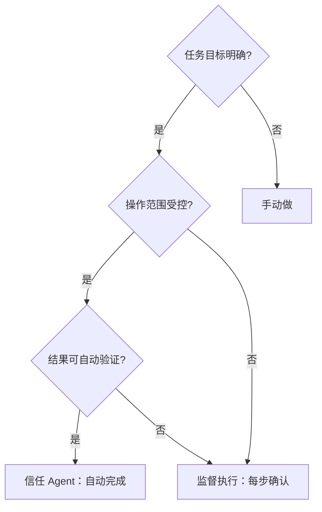

# 提示词工程与 Agent 入门：从写好一句话到让 AI 自己干活

> 阅读时间：约 50 分钟 | 适合有编程经验、想系统学习如何用好 AI 的开发者

你每天写代码，有多少时间花在了"非创造性"的重复劳动上？查日志、找 bug、写样板代码、写文档——这些事情必须做，但你可能不想做。

本教程和你一起走完这条路：从"给 AI 写好一句话"开始，到"让 AI 自己跑完整个任务"结束。我们会用一个真实的 Python 日志分析任务贯穿全文——你会看到同一个任务，随着技巧叠加，AI 的表现如何一步步提升。

在开始之前，我们先认识一下今天要用的两个工具：

- **pi agent**：开源的编程 Agent CLI。你可以在终端里和它对话，它可以读文件、写代码、运行命令——像一个坐在你旁边的结对编程伙伴。安装只需一行：`npm install -g @earendil-works/pi-coding-agent`。
- **promptfoo**：开源的提示词测试框架。就像单元测试 for LLM——告诉你哪个提示词更好，不是"凭感觉"，而是有数据。

好，我们开始。

---

## Part 1：开场 — AI 能帮你做什么？（5 分钟）

先看一个 30 秒的演示。

打开终端，进入我们的演示项目：

```bash
cd demo-project
pi
```

这个项目只有两个文件：

```
demo-project/
├── parse.py          # 一个日志解析脚本（有 bug）
└── sample.log        # 一段测试日志
```

`sample.log` 里是这几行日志：

```
2026-05-24 10:23:15 ERROR DatabaseError: connection timeout after 30s
2026-05-24 10:23:16 ERROR DatabaseError: connection timeout after 30s
2026-05-24 10:23:17 WARN  Retry failed for transaction tx-9981
2026-05-24 10:23:45 ERROR InternalError: null value in column "user_id"
2026-05-24 10:24:01 ERROR DatabaseError: too many connections (current: 150, max: 150)
2026-05-24 10:24:15 INFO  Connection pool restored
```

`parse.py` 是这个脚本——它有个 bug，只能解析 ERROR 行，WARN 和 INFO 全被漏掉了：

```python
import sys, re

def parse_log(filepath):
    errors = []
    with open(filepath) as f:
        for line in f:
            # BUG: 只匹配 ERROR，漏掉了 WARN 和其他级别
            match = re.match(r'(\d{4}-\d{2}-\d{2} \d{2}:\d{2}:\d{2}) ERROR (.+)', line)
            if match:
                errors.append({'time': match.group(1), 'msg': match.group(2)})
    return errors

if __name__ == '__main__':
    result = parse_log(sys.argv[1])
    print(f"Found {len(result)} errors")
    for e in result:
        print(f"  [{e['time']}] {e['msg']}")
```

运行一下：

```bash
$ python parse.py sample.log
Found 4 errors          ← 实际有 6 行日志，只解析出 4 行
  [2026-05-24 10:23:15] DatabaseError: connection timeout after 30s
  [2026-05-24 10:23:16] DatabaseError: connection timeout after 30s
  [2026-05-24 10:23:45] InternalError: null value in column "user_id"
  [2026-05-24 10:24:01] DatabaseError: too many connections (current: 150, max: 150)
```

看到没？6 行日志只解析出 4 条——WARN 和 INFO 行被正则表达式 `ERROR` 给过滤掉了。这就是我们要修的 bug。

现在在 pi agent 里输入：

```
这个项目里有一个日志解析脚本 parse.py 和一个日志文件 sample.log。帮我快速看一下有什么问题。
```

pi agent 会自己读文件、分析代码、指出正则的 bug、给出修改建议——整个过程不需要你告诉它"先看哪个文件"、"检查哪一行代码"。它自己决定。

**这节课学完，你能做到三件事：**

1. 写出高质量的提示词，让 AI 更好帮你写代码——输入质量决定输出质量
2. 理解 Agent 是怎么工作的——**Agent = 自动化的"思考→行动→观察"循环**，你从操作者变成监督者。就像自驾 vs 打车：你不再握方向盘，只需要告诉司机目的地
3. 判断什么时候该用 Agent、什么时候该自己动手

---

## Part 2：提示词工程 — 学会和 AI 说话（21 分钟）

**核心原则就一句话：输入的质量决定输出的质量。** 你对 AI 说"帮我改一下代码"——它猜。你说"分析 sample.log 中的 ERROR 行，按类型归类统计"——它直接给你结果。输入越精确，输出越靠谱；什么都不告诉它，它就瞎猜。

### 技巧一：角色设定（3 分钟）

如果你只能做一件事来改进提示词，那就是——**告诉 AI 它是谁**。

就像点菜前告诉厨师你的口味：说"我是四川人，爱吃辣" vs 什么都不说，做出来的菜完全不同。AI 也需要知道"你是谁"，才知道怎么回答。

我们来做个对比。在 pi 里分别试试这两条提示词：

> "分析 sample.log"

AI 的回答很泛泛——它不知道你是想修 bug、写报告、还是单纯看看数据。

> "你是一个资深 Python 后端开发，负责日志分析。请分析 sample.log"

加上角色后，AI 开始从开发者视角分析，提到正则匹配、异常归类等——因为它知道"我是开发者"，应该从代码角度思考。

就那么一句话的差别，效果天差地别。

### 技巧二：明确指令与约束（3 分钟）

角色设定让 AI 知道了"我是谁"。但光有身份还不够——你还得告诉它"我要什么、不要什么"。

模糊的指令 vs 精确的指令，差多少？看看对比：

| 模糊 | "帮我分析这个日志文件" |
|------|------|
| 精确 | "分析 sample.log：① 按错误类型分组 ② 统计每种错误出现次数 ③ 按次数降序排列" |

精确指令让 AI 的输出结构清晰——分组、统计、排序全都有。你给的约束越多，AI 的发挥空间越可控。

### 技巧三：Few-shot 示例（4 分钟）

有些东西很难用一句话描述清楚——比如你想要的代码风格、输出的详细程度。最直接的办法：**给 AI 看参考答案**。

老师出题时先讲一道例题，学生就清楚要答成什么样。AI 也一样——给它 1-2 个输入→输出的例子，比写 100 字描述更管用。

0-shot（不给示例）：

> "把 sample.log 中的错误信息提取出来"

AI 自由发挥，格式不确定。

2-shot（给两个示例）：

> 示例1：`ERROR timeout` → 输出：`{级别:ERROR, 原因:timeout, 建议:检查连接池}`
> 示例2：`ERROR null value` → 输出：`{级别:ERROR, 原因:null_value, 建议:加非空校验}`
> 现在分析 sample.log 中所有的行。

AI 严格遵循示例的输出格式——因为你给它看了"你想要的形状"。

### 技巧四：结构化输出（3 分钟）

现在 AI 的输出质量已经很好了，但如果你想把输出接入自动化流程——需要的不是优美的散文，而是机器能解析的 JSON。

最简单的方法：在提示词里明确要求 JSON 格式。

> "分析 sample.log，以 JSON 格式输出：`[{level, message, count}]`，只输出 JSON，不要其他文字"

但有个问题——AI 偶尔会输出格式错误的 JSON。多一个逗号、少一个引号，程序就崩了。更好的方案是用代码来保证。

**Pydantic AI** 的做法：用 Python 代码定义你期望的数据结构，让库自动处理校验和重试。

```python
from pydantic import BaseModel
from pydantic_ai import Agent

class LogEntry(BaseModel):
    time: str
    level: str
    message: str

class LogAnalysisResult(BaseModel):
    entries: list[LogEntry]
    total_errors: int
    summary: str

agent = Agent("openai:gpt-4o", output_type=LogAnalysisResult)
log_content = open("demo-project/sample.log").read()
result = agent.run_sync(f"分析以下日志，提取每行的时间、级别、消息。\\n{log_content}")
# result 是类型安全的 Python 对象，不是字符串
```

原理很简单——一张图就能看懂：



定义 Model → 转成 Schema → LLM 按 Schema 生成 → 校验 → 失败就自动重试。你拿到的永远是类型安全的 Python 对象。

对比一下两种方式：

| 方式 | 可靠性 | 适用场景 |
|------|--------|---------|
| Prompt 里要求 JSON | 依赖 LLM 输出质量，偶有格式错误 | 快速原型、一次性脚本 |
| Pydantic AI（代码定义 Schema） | 自动校验 + 重试，类型安全 | 生产环境、自动化流水线 |


---

### 技巧五：思维链 — Chain of Thought（4 分钟）

目前为止，我们学的都是"一轮对话"的技巧。但复杂问题不是一问一答能搞定的。

直接问它"parse.py 有什么 bug？"——它可能猜对也可能猜错。但如果你让它一步步推理：

> "请逐步分析：① 先看 sample.log 里有什么 ② 再看 parse.py 的代码逻辑 ③ 对比预期行为和实际行为 ④ 描述 bug"

AI 就会分步展示：步骤 1 列出 6 行日志（4 ERROR + 1 WARN + 1 INFO）、步骤 2 指出正则只匹配 ERROR、步骤 3 预测输出 4 条 vs 预期 6 条、步骤 4 给出结论。每一步推理都可追踪，即使结论有问题你也能找到是哪一步出了错。

### 技巧六：ReAct 模式（4 分钟）

思维链让 AI"在脑子里想"。但真正做开发时，光想不够——AI 需要**动手做事**：运行命令、读文件、看报错，然后根据实际结果调整。

这个"思考→行动→观察→再思考"的循环就是 **ReAct 模式**（Reasoning + Acting）。它是所有 AI Agent 的底层工作方式。



用一个你熟悉的场景来理解：做一道没做过的菜。先看菜谱（观察），想一下步骤（思考），切菜下锅（行动），尝一口咸淡（观察），觉得淡了再加盐（行动），再尝——反复直到味道对了。

现在，我们手动构造一个 ReAct 风格的对话：

```
第1轮：
  思考："先运行 parse.py 看它的输出"
  行动：运行 python parse.py sample.log
  观察：只输出了 4 条错误，但日志有 6 行

第2轮：
  思考："它漏掉了 WARN 和 INFO 行。需要看 parse.py 的代码逻辑"
  行动：读取 parse.py
  观察：正则只匹配了 'ERROR'，没有匹配 WARN 和 INFO
```

注意——每一轮的"行动"——运行命令、读文件——本质上都是 **Tool 调用**。Tool 是 Agent 的"手"，我们稍后会专门拆解它的原理。

### 技巧七：上下文组成与生命周期（3 分钟）

ReAct 模式好是好，但每轮都带着前面所有的上下文——对话越长，占用的 token 越多。AI 有上下文窗口的限制。

想象你在手机上开了一堆后台应用：开 1 个内存够用，开 10 个有点卡，开 50 个最早打开的就被系统杀掉了。Agent 的上下文也一样——对话越长，早期的内容就越可能被"清理"。但 System Prompt 不同：它是系统进程，永远不会被清掉。所以**关键信息要放在 System Prompt 里**。

Agent 的上下文由三部分组成：



System Prompt 是系统进程，永不清理，关键信息放这里。Tool Definitions 也是常驻的——工具越多，占的 token 越多。Messages 是动态的，不断累积，超过窗口就触发压缩。



压缩机制会保留最近约 20K tokens 的对话，把更早的内容用 LLM 总结成一段结构化摘要（目标、进度、决策、下一步），token 从几千缩到几百。后续再触发压缩时，在已有摘要基础上迭代更新，而不是重新总结全部历史。摘要虽不完美，但比"AI 忘了前面说过什么"要好得多。

---

## Part 3：Tool 调用 — AI 怎么"动手"？（12 分钟）

ReAct 中的"行动"步骤是关键——但 AI 自己不会动手。它只是在响应中输出一段 JSON。比如，LLM 想读 sample.log，它输出的不是文件内容，而是：

```json
{"name": "read_file", "arguments": {"path": "sample.log"}}
```

Agent Runtime 拦截这个 JSON → 真正调用 `read_file("sample.log")` → 拿到文件内容 → 把内容作为新消息回传给 LLM → LLM 根据结果继续推理。

**LLM 是大脑，Tool 是手。大脑决定"读那个文件"，手执行读取，触觉（文件内容）反馈回大脑。**



### pi 如何加载 Tool：extension 扫描与注册机制

在写自定义 Tool 之前，先理解 pi 是怎么发现和加载工具的。pi 在启动时会自动扫描指定目录，加载其中的 TypeScript 扩展文件：

```
pi 启动
  → 扫描 ~/.pi/agent/extensions/（用户级，所有项目可用）
  → 扫描 .pi/extensions/（项目级，仅当前项目生效）
  → 对每个 .ts 文件：编译 → 执行 export default → 传入 ExtensionAPI
  → Extension 调用 pi.registerTool() 注册工具
  → 工具名称 + Schema 注入 System Prompt（Tool Definitions 区域）
  → LLM 看到可用工具列表，在需要时输出 tool call
```

这意味着你只需要写一个 TypeScript 文件，放进正确的目录——pi 会在启动时自动发现、编译、加载。不需要手动配置，不需要重启服务。

在 Part 4 我们会详细讲解 Extension 的完整能力。现在，先聚焦在 Tool 本身上。

### Tool 调用的 6 步协议



一个完整的 tool 调用从 LLM 输出到结果回传，经过上述 6 个步骤：

| 步骤 | 发生了什么 | pi 源码中的钩子 |
|------|-----------|---------------|
| ① LLM 输出 tool call | LLM 流式输出 `{name, arguments}` | `message_update` |
| ② Schema 校验 + 权限检查 | TypeBox 验证参数类型 + `beforeToolCall` 权限门禁 | `validateToolArguments()` |
| ③ 执行工具 | 实际调用 `tool.execute(params)`，支持流式进度推送 | `tool.execute()` |
| ④ 返回结果 | 结构化结果 `{content, details, terminate}` | `AgentToolResult` |
| ⑤ 后处理 | `afterToolCall` 可重写结果、标记错误 | `afterToolCall()` |
| ⑥ 追加到对话 | toolResult 消息加入上下文，LLM 下轮看到它 | `context.messages.push()` |

几个关键的细节：
- **流式更新**：`onUpdate(partialResult)` 允许工具实时推送进度——用户能看到"正在读取第 3/10 个文件..."
- **权限门禁**：`beforeToolCall` 返回 `{block: true}` 可以拦截工具调用——比如"试图删除生产文件？拦截"
- **终止信号**：`terminate: true` 让 Agent 在工具执行后停止循环

### 实战：给 Agent 装一只新"手"

现在我们来写一个真正的工具——用 pi 的 TypeScript 扩展机制，注册一个 `count_log_levels` 工具，让 Agent 能自动统计日志级别分布。

一个 Tool 有三个核心要素：

**① Schema — 告诉 LLM 工具的参数格式**

```typescript
parameters: Type.Object({
    filepath: Type.String({ description: "日志文件路径" }),
}),
```

Schema 做两件事：告诉 LLM"这个工具需要一个 filepath 参数"，在运行时校验——如果 LLM 传了数字，TypeBox 直接拒绝。

**② Execute — 实际的业务逻辑**

```typescript
execute: async (toolCallId, params, signal, onUpdate) => {
    // 流式推送进度
    onUpdate({ content: [{ type: "text", text: "正在读取文件..." }], details: {} });

    const fs = await import("fs");
    const content = fs.readFileSync(params.filepath, "utf-8");
    const lines = content.split("\n").filter(l => l.trim());

    // 正则提取日志级别
    const counts: Record<string, number> = {};
    for (const line of lines) {
        const match = line.match(/^\d{4}-\d{2}-\d{2} \d{2}:\d{2}:\d{2} (\w+)/);
        if (match) counts[match[1]] = (counts[match[1]] || 0) + 1;
    }

    return {
        content: [{ type: "text", text: JSON.stringify({ counts }, null, 2) }],
        details: { totalLines: lines.length, counts },
    };
},
```

**③ Hook — 权限控制**

```typescript
pi.on("tool_call", async (event) => {
    if (event.toolName !== "count_log_levels") return;
    const params = event.args ?? event.arguments ?? {};
    const filepath = (params?.filepath ?? params?.filePath ?? "") as string;
    if (!filepath?.endsWith(".log")) {
        return { block: true, reason: "只允许分析 .log 文件" };
    }
});
```

注册后，在 pi 中输入"用 count_log_levels 分析 sample.log"，Agent 会自动调用该工具。记住这个三要素——**Schema 定义接口、Execute 执行逻辑、Hook 控制权限**——任何 Agent 框架的工具系统，本质上都是这三件事。

#### 如何确认工具真的被调用了？

有个重要的细节需要注意——LLM 收到工具返回的原始数据后，会在回复中用自己的话重新组织措辞。你看到的终端输出可能是这样：

```
日志中共 6 行，ERROR: 4 条，WARN: 1 条，INFO: 1 条
```

但它也可能用 pi 内置的 `read` 工具直接读文件、自己数出同样的结果。**只看终端输出，你无法判断是自定义工具被调用了，还是 LLM 绕过了它。**

验证方法：在工具的返回值里埋一个唯一标记，然后检查 pi 的 session 日志。

第一步，改造 execute 函数，在输出中加上标记：

```typescript
return {
    content: [{
        type: "text",
        text: "[TOOL:count_log_levels] " + JSON.stringify({ totalLines, levelCounts }),
    }],
};
```

第二步，运行 pi 后查看 session 日志。pi 把每次会话的完整记录保存在 `~/.pi/agent/sessions/` 目录下，每个 session 一个 `.jsonl` 文件：

```bash
ls -t ~/.pi/agent/sessions/ | head -1  # 找到最近的 session
```

用 `grep` 搜索工具名：

```bash
grep 'count_log_levels' ~/.pi/agent/sessions/<session-id>.jsonl
```

你会看到三条关键记录，清楚地展示了完整的调用链：

```
1. LLM 思考："要用 count_log_levels 工具，调用它"
2. LLM 输出：toolCall { name: "count_log_levels", arguments: { filepath: "..." } }
3. Runtime 执行：toolResult { toolName: "count_log_levels",
             content: "[TOOL:count_log_levels] {\"totalLines\":6,
                      \"levelCounts\":{\"ERROR\":4,\"WARN\":1,\"INFO\":1}}" }
```

`[TOOL:count_log_levels]` 这个前缀只存在于 execute 函数的返回代码中——LLM 不可能凭空生成它。这就是工具被 Runtime 真实执行的**确凿证据**。

这个验证技巧在你调试自定义工具时非常实用：**不要只看 LLM 说了什么，去翻 session 日志看它实际调用了什么。**

### Agent 核心循环

把 Tool 调用的 6 步协议放进 Agent 的工作循环，就是这个四步流程：

```
用户 → Agent → [① 理解任务 → ② 选择并执行工具 → ③ 观察结果 → ④ 判断是否继续] → 用户

四步对应 Tool 协议：
① 理解任务 — Agent 解读目标、拆分子任务
② 选工具+执行 — ①~③（tool call → 校验 → execute）
③ 观察结果 — ④~⑤（result → afterToolCall）
④ 判断继续 — ⑥（追加 toolResult，LLM 看到结果决定下一步）
```

这就是 Agent 的核心——**把 Tool 调用嵌入自主循环**。你不再手动写每一步的提示词，Agent 自己决定"下一步调用哪个工具"。

> **费曼检查**：Tool 调用的三个关键角色是什么？不用术语，用大白话说。

---

## Part 4：pi Extension 机制 — Agent 的插件框架（4 分钟）

前面实战中用到了 `registerTool` 和 `pi.on("tool_call")`——它们从哪来？这就是 Extension 机制。

一个 Extension = 一个 TypeScript 文件，默认导出函数，接收 `ExtensionAPI` 对象：

```typescript
// extensions/my-extension.ts
export default function (pi: ExtensionAPI) {
    // 注册工具、监听事件、添加命令...
}
```

pi 启动时自动扫描三个位置：
- `~/.pi/agent/extensions/`（用户级，所有项目可用）
- `.pi/extensions/`（项目级，仅当前项目）
- `settings.json` 中 `extensions` 数组（显式路径）

Extension 的完整生命周期：



**ExtensionAPI 的核心能力：**

| 能力 | API | 用途 |
|------|-----|------|
| 注册工具 | `pi.registerTool({...})` | 给 Agent 装新"手" |
| 注册命令 | `pi.registerCommand("name", {handler})` | `/mycommand` 斜杠命令 |
| 生命周期钩子 | `pi.on("event", handler)` | session_start、agent_start、tool_call、agent_end |
| 权限门禁 | `handler → {block: true}` | 拦截危险操作 |
| 流式更新 | `onUpdate(partialResult)` | 工具执行中推送进度 |
| 会话状态 | `pi.appendEntry(type, data)` | 跨回合持久化数据 |

回到我们的 `log-tools.ts`——这个 Extension 只有 50 行代码，但给 Agent 装上了一只新"手"。掌握了 ExtensionAPI，你可以在 Agent 上挂载任何自定义逻辑。

---

## Part 5：提示词测试 — 用 promptfoo 量化好坏（6 分钟）

现在 Tool 可以调用了，Extension 也懂了。但还有一个根本问题：**提示词本身的质量怎么保证？**

你写了一个提示词，改了改，怎么知道"改对了"？靠感觉？靠看一次输出？

我们把 TDD 理念带入提示词工程——**promptfoo** 是开源工具（MIT 协议，60K+ GitHub stars），把提示词测试组织成一个 YAML 配置文件。

安装：

```bash
npm install -g promptfoo
```

**三个核心概念**：

```
promptfooconfig.yaml
├── prompts:    要测试的提示词（可以多个版本对比）
├── providers:  用哪个模型跑（GPT-4o / Claude / Gemini / …）
└── tests:      测试用例 + 断言（输入 + 什么算对）
```

来看一个实际配置——两个字提示词版本：A 直接问，B 加了角色设定和 JSON 输出约束。3 个测试用例：

```yaml
prompts:
  # 版本 A：无角色设定
  - "分析以下日志中的错误：{{log_content}}"
  # 版本 B：有角色 + 结构化输出
  - "你是资深 SRE。分析以下日志，以 JSON 数组格式输出。{{log_content}}"

providers:
  - openai:gpt-4o

tests:
  # 用例 1：混合级别，应识别 ERROR 和 WARN
  - vars:
      log_content: |
        2026-05-24 10:23:15 ERROR DatabaseError: connection timeout
        2026-05-24 10:23:17 WARN  Retry failed
        2026-05-24 10:24:15 INFO  Connection pool restored
    assert:
      - type: javascript
        value: JSON.parse(output).length >= 2

  # 用例 2：应指出具体错误类型
  - vars:
      log_content: |
        2026-05-24 10:23:45 ERROR InternalError: null value in column "user_id"
    assert:
      - type: icontains
        value: "null value"

  # 用例 3：只有 INFO 的日志，输出应为空数组
  - vars:
      log_content: |
        2026-05-24 10:24:15 INFO  Connection pool restored
    assert:
      - type: javascript
        value: JSON.parse(output).length === 0
```

运行测试：

```bash
promptfoo eval
```

命令行显示结果——版本 A 通过率低（没有角色和格式约束），版本 B 通过率高。这不是"感觉"，是数据。

```bash
promptfoo view
```

打开 Web UI，你可以并排对比两个版本的输出、通过/失败标记、延迟和 token 成本。

**测试循环图**就像写代码的 TDD 循环：

```
写提示词 → 定义测试用例 → promptfoo eval → 查看结果 → 改进提示词 → 重新跑
```



每次改提示词，重新跑 `promptfoo eval`，立刻知道改对了还是改错了。甚至可以放进 CI/CD——提示词改动自动回归测试。

> **费曼检查**：promptfoo 的三个核心概念是什么？用大白话说。

---

## Part 6：Skill — Agent 的知识库（11 分钟）

Tool 是 Agent 的"手"（执行操作），promptfoo 是"尺"（衡量质量），但 Agent 还需要一样东西——**知识库**。这就是 Skill。

### Skill vs Tool — 到底差在哪？

一句话区分：**Tool 是手，干活的；Skill 是说明书，告诉手怎么干。**

| | Tool | Skill |
|------|------|------|
| **作用** | 执行操作（读文件、运行命令） | 注入知识/流程（领域知识、工作流模板） |
| **注入位置** | 对话消息（tool result） | System Prompt |
| **触发方式** | LLM 输出 tool call | Agent 启动时自动加载 |
| **生命周期** | 按需调用，用完即弃 | 整个 session 常驻 |

Tool 的结果进入对话消息——LLM "看到"了工具执行结果。Skill 的指令进入 System Prompt——Agent 整个会话都"记得"怎么做事。

### agentskill.io 规范：渐进式加载

Skill 遵循 **Agent Skills 开放标准**（agentskill.io）。核心设计是**渐进式加载**——一个 Skill 有三层，只在需要时才加载更深层的内容。

来看我们准备好的 `.pi/skills/log-analyzer/` 目录：

```
.pi/skills/log-analyzer/
├── SKILL.md              # 核心指令（YAML 头部 + Markdown 正文）
├── scripts/
│   └── parse_log.py      # 辅助脚本
└── references/
    └── log-patterns.md   # 参考知识（常见日志模式）
```

`SKILL.md` 的内容结构和渐进式加载机制：

```markdown
---
name: log-analyzer
description: 分析日志文件，找出错误根因并给出修复建议。当用户提到"日志分析"、"找 bug"时使用。
---

# 日志分析器

## 分析流程
### 第1步：理解数据 — 读取日志，统计级别分布
### 第2步：阅读源码 — 理解代码的解析逻辑
### 第3步：对比分析 — 日志实际内容 vs 代码预期行为
### 第4步：定位根因 — 找到不匹配的具体代码行
### 第5步：修复建议 — 给出具体修改方案
### 第6步：验证修复 — 运行并确认
```

三层加载机制：

```
Agent 启动
  → ① metadata 层（~100 tokens）：只读 SKILL.md 的 YAML 头部（name + description），常驻内存
  → 用户说"帮我分析日志"
    → ② 指令层（500-5000 tokens）：匹配到 description，加载完整 SKILL.md 正文
    → 需要查日志模式
      → ③ 资源层（按需）：加载 references/log-patterns.md
```



靠这三层，Agent 可以管理几十上百个 Skill 而不会撑爆上下文。这个设计就是 Progressive Disclosure（渐进式加载）。

### 实战演示

在 pi 中验证 Skill 的完整生命周期：

```bash
cd demo-project
pi
```

pi 启动时自动扫描 `.pi/skills/` 目录——在 available_skills 中你可以看到 `log-analyzer`。输入"帮我分析 sample.log 的错误根因"，Agent 自动匹配 description → 加载完整的 SKILL.md 指令 → 按 6 步流程执行（理解数据→阅读源码→对比分析→定位根因→修复建议→验证修复）→ 需要时按需加载 `references/log-patterns.md`。

回到最开始的洞察：把反复使用的提示词封装成 Skill，下次一键调用。你不必每次都敲一遍分析流程——Skill 帮你记住了。

### Agent 的局限与边界

Tool 和 Skill 给了 Agent 强大能力，但它有边界。延续打车的比喻：大路司机认识，小路岔口仍需你指路。

**什么时候该信任 Agent，什么时候该介入？**



**三个安全原则：**

1. **不盲信**：Agent 输出和人类代码一样需要 review——它修好了 parse.py 的正则，但也许引入了新问题
2. **隔离环境**：用 git worktree 或 Docker 限制 Agent 的操作范围，避免误删文件
3. **可回滚**：所有修改都应可撤销——git commit 是最好的保险

> **费曼检查**：Tool 和 Skill 有什么区别？用大白话说。

---

## Part 7：总结 — 你今天学到了什么

我们从"怎么给 AI 写一句话"走到了"怎么让 AI 自己跑完整个任务"。回顾一下核心收获：

1. **好提示词 = 清晰角色 + 结构化要求 + 示例**——输入质量决定输出质量
2. **进阶技巧让 AI 自己思考验证**——思维链（一步步推理）、ReAct（思考→行动→观察循环）、上下文管理（三层结构，超限压缩）
3. **Tool = Agent 的"手"**——Schema 定义接口、Execute 执行逻辑、Hook 控制权限。LLM 输出 tool call → Runtime 执行 → 结果回传
4. **Agent = 自动化的"思考→行动→观察"循环**——把前面所有技巧内化成了自动流程，你从操作者变成监督者

---

**延伸学习：**

- **pi agent**：`npm install -g @earendil-works/pi-coding-agent`，[github.com/earendil-works/pi](https://github.com/earendil-works/pi)
- **promptfoo**：`npm install -g promptfoo`，[promptfoo.dev](https://www.promptfoo.dev)
- **Agent Skills 标准**：[agentskill.io](https://agentskill.io)

**最后留一个问题给你**：你日常开发中哪个环节最想先用 Agent 来提效？想一想，然后打开终端试试看。

---

## 附录：关键概念速查

| 概念 | 一句话解释 | 记忆口诀 |
|------|-----------|---------|
| 提示词工程 | 学会怎么跟 AI 说话 | 输入决定输出 |
| 角色设定 | 给 AI 一个身份 | 点菜前告诉厨师口味 |
| 明确指令 | 告诉 AI 要什么、不要什么 | API 参数——精确才拿到 |
| Few-shot | 给 AI 看期望的输出样例 | 例子比描述更直接 |
| 结构化输出 | 让 AI 输出 JSON | 程序自动消费 |
| 思维链 CoT | 写出推理过程，比只给答案可靠 | 批卷看过程不看答案 |
| ReAct | 思考→行动→观察→再思考 | Agent 的底层工作模式 |
| 上下文管理 | 三层结构 + 压缩 | 手机后台——开太多就清最早的 |
| Skill | 好提示词封装复用 | 一次封装，多次调用 |
| Tool | Agent 的执行器 | Schema + Execute + Hook |
| Agent | 自动化的思考+行动+观察循环 | 自驾 vs 打车 |
| promptfoo | 提示词测试框架 | 单元测试 for LLM |

---

*本文所用演示项目位于 `demo-project/`，完整 Skill 示例位于 `.pi/skills/log-analyzer/`，Tool 扩展示例位于 `scripts/log-tools.ts`，promptfoo 配置位于 `scripts/promptfooconfig.yaml`。*
