# 提示词工程与 Agent 入门 — 培训讲义

## 课程信息

- **时长**：66 分钟（64 分钟内容 + 2 分钟缓冲）
- **受众**：有编程经验的开发工程师
- **方法**：费曼学习法 — 用类比和实例解释每个概念
- **工具**：[pi agent](https://github.com/earendil-works/pi) — 开源编程 Agent CLI

## 演示场景

整场培训使用同一个 Python 日志解析任务贯穿。

**项目结构**：

```
demo-project/
├── parse.py          # 日志解析脚本（有 bug）
└── sample.log        # 测试日志文件
```

**`sample.log`**（6 行，含 ERROR、WARN、INFO）：

```
2026-05-24 10:23:15 ERROR DatabaseError: connection timeout after 30s
2026-05-24 10:23:16 ERROR DatabaseError: connection timeout after 30s
2026-05-24 10:23:17 WARN  Retry failed for transaction tx-9981
2026-05-24 10:23:45 ERROR InternalError: null value in column "user_id"
2026-05-24 10:24:01 ERROR DatabaseError: too many connections (current: 150, max: 150)
2026-05-24 10:24:15 INFO  Connection pool restored
```

**`parse.py`**（有 bug — 正则只匹配 ERROR，漏掉 WARN/INFO）：

```python
import sys
import re

def parse_log(filepath):
    errors = []
    with open(filepath) as f:
        for line in f:
            # BUG: 只匹配 ERROR，漏掉了 WARN 和其他级别
            match = re.match(r'(\d{4}-\d{2}-\d{2} \d{2}:\d{2}:\d{2}) ERROR (.+)', line)
            if match:
                errors.append({'time': match.group(1), 'msg': match.group(2)})
    return errors

if __name__ == '__main__':
    result = parse_log(sys.argv[1])
    print(f"Found {len(result)} errors")
    for e in result:
        print(f"  [{e['time']}] {e['msg']}")
```

运行 `python parse.py sample.log` 输出：

```
Found 4 errors          ← 实际有 6 行日志，只解析出 4 行
  [2026-05-24 10:23:15] DatabaseError: connection timeout after 30s
  [2026-05-24 10:23:16] DatabaseError: connection timeout after 30s
  [2026-05-24 10:23:45] InternalError: null value in column "user_id"
  [2026-05-24 10:24:01] DatabaseError: too many connections (current: 150, max: 150)
```

---

## Part 1：开场与问题设定（5 分钟）

### 破冰（1 分钟）

> 你每天写代码，有多少时间花在非创造性的重复劳动上？查日志、找 bug、写样板代码、写文档……这些事情必须做，但不是你想做的。如果有一个工具能帮你分担这些，你会用吗？怎么用？

**过渡**：AI 工具可以帮你省下这些时间——但不是装上就能用好的。今天的目标就是让你学会怎么驾驭它。

### 课程目标（2 分钟）

学完这堂课，你能：

1. 写出高质量提示词，让 AI 更好帮你写代码
2. 理解 Agent 是什么、怎么工作的——**Agent = 自动化的"思考→行动→观察"循环**，你从操作者变成监督者。就像自驾 vs 打车：你不再握方向盘，只需要告诉司机目的地
3. 判断什么时候该用 Agent

**过渡**：空讲理论没意思，我们先花 30 秒看一眼——用今天要讲的工具 pi agent，它能帮我们做什么。

### 预告演示（2 分钟）

讲师在终端输入一个简单任务，pi agent 在 30 秒内完成分析并给出建议。学员看到：
- pi agent 能读文件、分析问题、给出修改建议
- 这个过程看起来"像魔法一样"

---

< 衔接过渡 1 → 2 >

刚才看了 pi agent 能做到多厉害的事，但关键问题来了——不是随便打几个字就能得到这种结果。提示词写得好不好，结果天差地别。我们先从最基础的技巧开始，看看怎么让 AI 听懂你的话。

---

## Part 2：提示词工程（21 分钟）

提示词工程的核心就一句话：**输入的质量决定输出的质量**。

### 什么是提示词工程（2 分钟）

提示词工程听起来高大上，其实就是**学会怎么跟 AI 说话**。

你对 AI 说"帮我改一下代码"——它猜。你说"分析 sample.log 中的 ERROR 行，按类型归类统计"——它直接给你结果。输入越精确，输出越靠谱；什么都不告诉它，它就瞎猜。

**过渡**：所以提示词工程听起来高大上，其实就是"学会怎么跟 AI 说话"。那我们从头开始——如果你只能做一件事来改进提示词，那就是告诉 AI 它是谁。

### 技巧一：角色设定（3 分钟）

告诉 AI 你是谁，它才知道怎么回答——就像点菜前告诉厨师你的口味，不说就只能吃默认的。

**演示**：讲师在 pi 中依次运行两个提示词，对比输出。

| 回合 | 提示词 | 效果 |
|------|--------|------|
| 无角色 | "分析 sample.log" | AI 泛泛回答，不知道分析什么维度 |
| 有角色 | "你是一个资深 Python 后端开发，负责日志分析。请分析 sample.log" | AI 开始从开发者视角分析，提到正则匹配、异常归类等 |

**过渡**：角色设定让 AI 知道了"我是谁"，但光有身份还不够——你还得告诉它"我要什么、不要什么"。

### 技巧二：明确指令与约束（3 分钟）


**演示**：对比模糊指令和精确指令。

| 回合 | 提示词 | 效果 |
|------|--------|------|
| 模糊 | "帮我分析这个日志文件" | AI 输出一段自由文本，格式随意 |
| 精确 | "分析 sample.log，按错误类型分组，统计每种错误出现次数，按次数降序排列" | AI 给出结构化清晰的分析 |

**过渡**：精确指令能让 AI 不跑偏，但有些东西——比如你想要的代码风格、分析深度——很难用一句话描述清楚。最直接的办法：给个参考答案。

### 技巧三：Few-shot 示例（4 分钟）

给一两个输入→输出的例子，AI 就能照猫画虎。比写 100 字描述更管用。

**演示**：0-shot vs 2-shot 对比。

| 回合 | 提示词 | 效果 |
|------|--------|------|
| 0-shot | "把 sample.log 中的错误信息提取出来" | AI 自由发挥，格式不确定 |
| 2-shot | "示例输入：`ERROR timeout` → 输出：`{级别:ERROR, 原因:timeout, 建议:检查连接池}`。示例输入：`ERROR null value` → 输出：`{级别:ERROR, 原因:null_value, 建议:加非空校验}`。现在分析 sample.log 中所有的行。" | AI 严格遵循给定的输出格式 |

**过渡**：现在 AI 的输出质量已经很好了，但这是面向人读的。如果你想把 AI 的输出接入自动化流程，需要的不是一段优美的散文，而是机器能解析的结果。

### 技巧四：结构化输出（3 分钟）


**演示（1.5 分钟）**：对比无格式约束和 JSON 约束。

| 回合 | 提示词 | 效果 |
|------|--------|------|
| 自由文本 | "分析 sample.log 的错误" | AI 输出散文，无法程序化解析 |
| JSON 约束 | "分析 sample.log，以 JSON 格式输出：`[{level, message, count}]`，只输出 JSON，不要其他文字" | AI 输出纯 JSON，可直接被程序消费 |

但仅仅 "prompt 里要求输出 JSON" 有个问题——AI 偶尔会输出格式错误的数据（多一个逗号、少一个引号），你的程序就会崩溃。

**Pydantic AI 方案（1.5 分钟）**：用代码定义数据结构，让库自动处理校验和重试。

```python
# 1. 用 Pydantic 定义你期望的数据结构
from pydantic import BaseModel

class LogEntry(BaseModel):
    time: str
    level: str
    message: str

class LogAnalysis(BaseModel):
    entries: list[LogEntry]
    total_errors: int
    summary: str

# 2. 把 Model 交给 LLM，库自动处理校验和重试
# AI 返回的数据会自动校验类型
# 如果格式不对，库会自动把错误信息喂给 LLM 重试
result = agent.run_sync(
    "分析 sample.log",
    result_type=LogAnalysis  # ← 这就是你要的"表单"
)
# result 是类型安全的 Python 对象，不是字符串
```

**Pydantic AI 原理**：

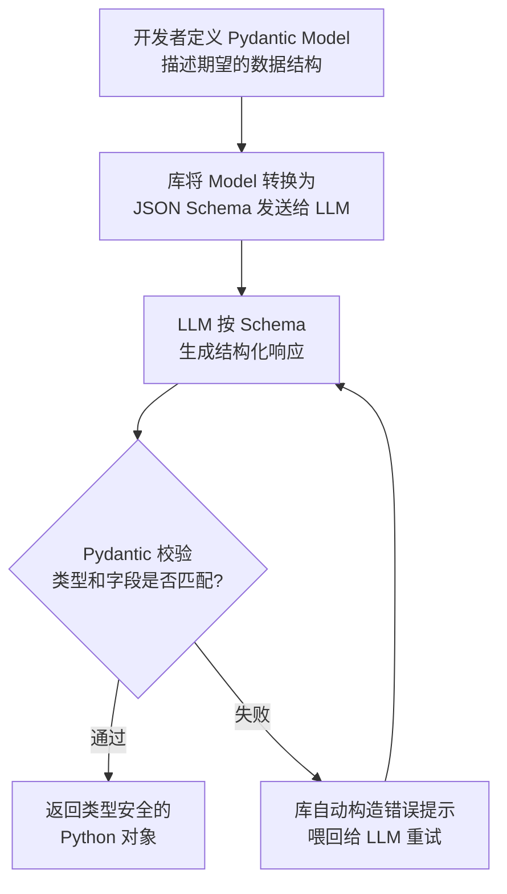

**对比两种方式**：

| 方式 | 可靠性 | 使用场景 |
|------|--------|---------|
| Prompt 约束 JSON | 依赖 LLM 输出质量，偶有格式错误 | 快速原型、一次性脚本 |
| Pydantic AI（代码定义 Schema） | 自动校验 + 重试，类型安全 | 生产环境、自动化流水线 |

---

**费曼检查**："你同事发了一条提示词，AI 回复很烂。你加上一句话——'你是一个资深 Python 后端开发'——AI 的回复立刻好了。为什么这一句话有这么大作用？用你自己的话解释。"（讲师停顿 8 秒，不点名，学生自检）

---

---

### 进阶技巧

### 技巧五：思维链（Chain of Thought, CoT）（4 分钟）


**演示**：直接要答案 vs 分步推理。

| 回合 | 提示词 | 效果 |
|------|--------|------|
| 直接回答 | "parse.py 有什么 bug？" | AI 可能猜对也可能猜错 |
| CoT | "请逐步分析：① 先看 sample.log 里有什么 ② 再看 parse.py 的代码逻辑 ③ 对比预期行为和实际行为 ④ 描述 bug" | AI 分步推理，结论有据可查 |

**过渡**：思维链是让 AI 在脑子里多转几圈。但真正的开发场景里，光想不够——AI 需要动手做事：运行命令、读文件、看报错，然后根据实际结果调整。这个"思考 + 行动 + 观察 + 再思考"的循环，就是 ReAct 模式——它也是后面要讲的 Agent 的核心机制。

### 技巧六：ReAct 模式（4 分钟）

ReAct = 思考→行动→观察→再思考。这个循环是所有 AI Agent 的底层工作方式。

**ReAct 循环示意**：

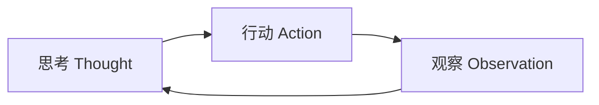

**演示**：手动构造一个 ReAct 风格的多轮对话，展示每一步。

```
提示词："我们来排查 parse.py 的 bug。每轮你只做一件事：①思考下一步做什么 ②执行 ③观察结果 ④决定是否继续"

第1轮：
  思考："先运行 parse.py 看它的输出"
  行动：运行 python parse.py sample.log
  观察：只输出了 4 条错误，但日志有 6 行

第2轮：
  思考："它漏掉了 WARN 和 INFO 行。需要看 parse.py 的代码逻辑"
  行动：读取 parse.py
  观察：正则只匹配了 'ERROR'，没有匹配 WARN 和 INFO
```

**注意**：刚才演示中 AI 的每个"行动"——运行命令、读文件——本质上都是 **Tool 调用**。Tool 是 Agent 的"手"，我们稍后会专门拆解它的原理。

**过渡**：ReAct 模式好是好，但每轮都带着前面所有的上下文——对话越长，占用的 token 越多。AI 有上下文窗口的限制。

### 技巧七：Agent 上下文组成与生命周期（3 分钟）

对话越长，早期内容越可能被"清理"——像手机后台，开太多最早的就杀了。但 System Prompt 是系统进程，永不清理。关键信息放这里。

**Agent 的上下文由三部分组成**：

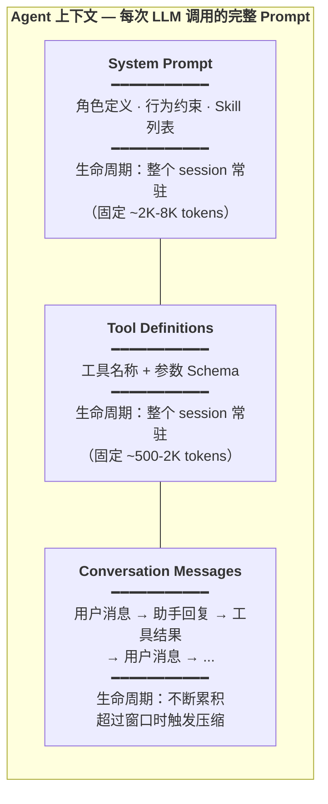

**每部分的生命周期详解**：

| 部分 | 何时加载 | 何时失效 | Token 占比 | 管理策略 |
|------|---------|---------|-----------|---------|
| **System Prompt** | Session 开始时注入 | Session 结束 | ~15-30%（固定） | 尽量精简，关键信息前置 |
| **Tool Definitions** | Session 开始时注入 | Session 结束 | ~5-10%（固定） | 只给必要的工具，避免工具爆炸 |
| **Messages（对话记录）** | 每轮对话追加 | 超过窗口时压缩 | 剩余空间全部 | 旧消息→压缩摘要，思考块→可丢弃 |

**对话消息的累积与压缩**：

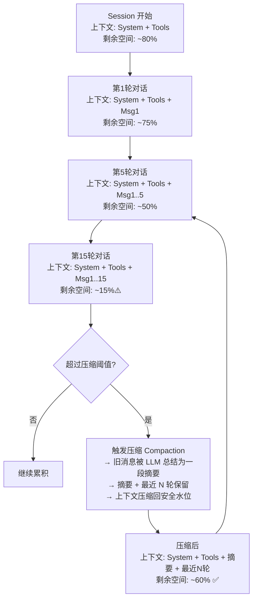

**压缩（Compaction）的机制**：

当上下文 tokens 超过 `模型窗口 - 预留空间`（pi 默认预留 16K tokens）时触发：

1. **选择切割点**：保留最近 ~20K tokens 的对话，更早的进入压缩区
2. **生成摘要**：用一个轻量模型调用，把旧对话压缩成结构化摘要（目标、进度、决策、下一步）
3. **替换历史**：摘要替代原始对话进入上下文，tokens 从几千缩到几百
4. **迭代更新**：后续再触发压缩时，在已有摘要基础上更新，而非重新总结全部历史

**核心原则**：

- **关键信息放 System Prompt**：它永远不被压缩，是最安全的位置
- **长对话信任摘要**：压缩后的摘要虽不完美，但比"AI 忘了前面说过什么"要好得多
- **工具输出精简**：工具返回结果尽量只保留关键部分，别把 10MB 日志全塞进上下文

**过渡**：现在你的工具箱里已经有好几件利器了——CoT、ReAct、上下文管理。但每次用的时候都重新敲一遍提示词太傻了。程序员的本能反应是什么？封装复用。


**Skill 的目录结构**：

```
skills/log-analyzer/
├── SKILL.md              # 核心：YAML 头部 + Markdown 指令
├── scripts/
│   └── parse_log.py      # 辅助脚本
└── references/
    └── log-patterns.md   # 参考知识（常见日志模式）
```

**SKILL.md 的核心要素**：

```yaml
---
name: log-analyzer
description: 分析日志文件，找出错误根因并给出修复建议。
             当用户提到"日志分析"、"找 bug"时使用。
---

# 日志分析器

## 分析流程
### 第1步：理解数据 — 读取日志，统计级别分布
### 第2步：阅读源码 — 理解代码的解析逻辑
### 第3步：对比分析 — 日志实际内容 vs 代码预期行为
### 第4步：定位根因 — 找到不匹配的具体代码行
### 第5步：修复建议 — 给出具体修改方案
### 第6步：验证修复 — 运行并确认
```

**演示**：讲师在编辑器中打开 `skills/log-analyzer/SKILL.md`，展示完整的 Skill 文件。强调：

- YAML 头部（name + description）让 Agent 自动发现这个 Skill
- 6 步分析流程把 CoT 模式封装成了可复用的模板
- `references/log-patterns.md` 是辅助知识库，按需加载
- 这个 Skill 可以在 Claude Code、Gemini CLI、Cursor、GitHub Copilot 等 40+ 平台通用

**Skill 加载机制**（展示 Mermaid 图）：

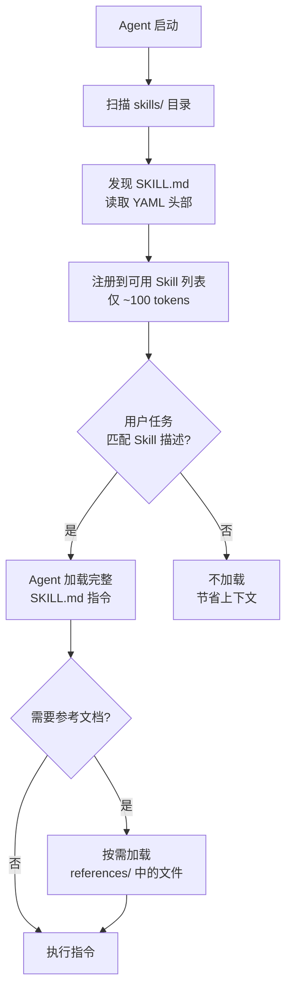

这就是**渐进式加载**（Progressive Disclosure）——Skill 的 metadata（~100 tokens）常驻，完整指令（<5000 tokens）按需加载，参考文件进一步按需加载。上下文效率最大化。

---

**费曼检查**："你要用 ReAct 模式教 AI 排查一个 bug——它会先做什么？然后做什么？最后怎么知道做完了？不用术语，用大白话说出这三步。"（讲师停顿 8 秒，学生自检。三步 = 先观察数据 → 再行动验证 → 看结果判断是否继续）

---


< 衔接过渡 2 → 3 >

ReAct 模式里有一个关键步骤——"行动"。AI 自己不会动手——你需要给它工具。接下来我们看看，AI 怎么使用工具、工具调用背后发生了什么。

---

## Part 3：Tool 调用原理与实践（12 分钟）

定位：把 ReAct 中"行动"这一步具体化——LLM 如何输出 tool call、Agent runtime 如何执行、开发者如何注册自定义工具。

### Tool 调用的本质（2 分钟）

LLM 本身不执行工具。它只是输出一个结构化的 JSON：

```json
{ "name": "read_file", "arguments": { "path": "sample.log" } }
```

Agent runtime 拦截这个响应 → 执行真正的 `read_file("sample.log")` → 把结果作为新消息追加到对话 → LLM 根据结果继续推理。

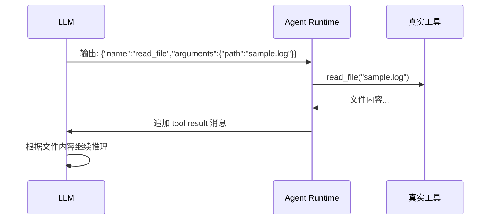

**核心理解**：LLM 是大脑，Tool 是手。大脑决定"读那个文件"，手执行读取，触觉（文件内容）反馈回大脑。

**过渡**：协议的每一步都有具体的钩子。我们对照 pi agent 的源码，看一个 Tool 调用从出生到死亡经历了什么。

### Tool 调用协议与生命周期（3 分钟）

一个完整的 tool 调用从 LLM 输出到结果回传，经过协议定义的 6 个步骤：

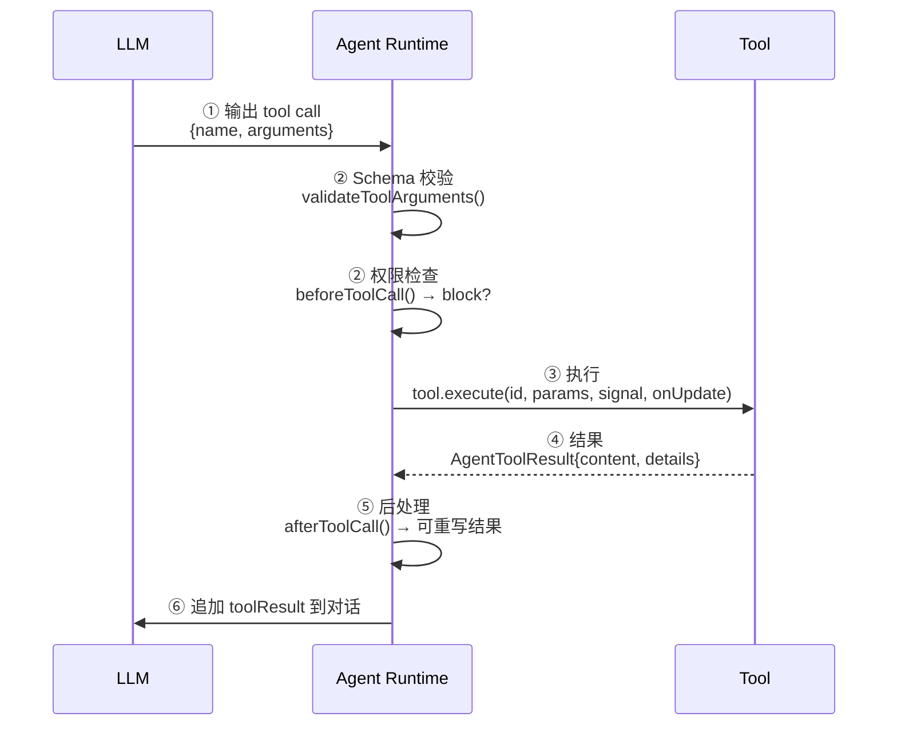

**pi 源码对照**：

| 步骤 | pi 钩子 | 作用 |
|------|--------|------|
| ① LLM 输出 | `message_update (toolcall_start/delta/end)` | 流式接收 tool call 参数 |
| ② Schema 校验 | `validateToolArguments()` + `beforeToolCall` | TypeBox schema 验证 + 权限门禁 |
| ③ 执行 | `tool.execute(toolCallId, params, signal, onUpdate)` | 实际调用，支持流式进度推送 |
| ④ 结果返回 | `AgentToolResult { content, details, terminate }` | 结构化结果 |
| ⑤ 后处理 | `afterToolCall({ result, isError })` | 可重写结果、标记错误 |
| ⑥ 追加对话 | `context.messages.push(toolResult)` | LLM 下轮带上工具结果 |

**关键细节**：
- **流式更新**：`onUpdate(partialResult)` 允许工具实时推送进度（如"正在读取第 3/10 个文件……"）
- **权限门禁**：`beforeToolCall` 返回 `{ block: true }` 可拦截（如"试图删除生产文件？拦截"）
- **终止信号**：`terminate: true` 让 Agent 在工具执行后停止循环
- **并行执行**：多个 tool call 可并发执行，按 LLM 输出顺序组装结果

**过渡**：原理懂了，我们来写一个真正的工具——用 pi 的 TypeScript 扩展机制，给 Agent 装上一只新手。

### 实战：注册自定义 Tool（3 分钟）

场景：为演示项目注册一个 `count_log_levels` 工具，让 Agent 可以自动统计日志级别分布。

讲师在编辑器中打开 `scripts/log-tools.ts`，逐段讲解：

```typescript
// scripts/log-tools.ts
import type { ExtensionAPI } from "@earendil-works/pi-coding-agent";
import { Type } from "@earendil-works/pi-ai";

export default function (pi: ExtensionAPI) {

  // ① Schema：定义工具的参数格式（LLM 据此判断何时调用）
  pi.registerTool({
    name: "count_log_levels",
    label: "统计日志级别",
    description: "读取日志文件，统计 ERROR/WARN/INFO 各级别数量",
    parameters: Type.Object({
      filepath: Type.String({ description: "日志文件路径" }),
    }),

    // ② Execute：实际的业务逻辑
    execute: async (toolCallId, params, signal, onUpdate) => {
      onUpdate({ content: [{ type: "text", text: "正在读取文件..." }], details: {} });

      const fs = await import("fs");
      const content = fs.readFileSync(params.filepath, "utf-8");
      const lines = content.split("\n");

      const counts: Record<string, number> = {};
      for (const line of lines) {
        const match = line.match(/\d{4}-\d{2}-\d{2} \d{2}:\d{2}:\d{2} (\w+)/);
        if (match) counts[match[1]] = (counts[match[1]] || 0) + 1;
      }

      return {
        content: [{ type: "text", text: JSON.stringify(counts, null, 2) }],
        details: { totalLines: lines.length, counts },
      };
    },
  });

  // ③ Hook：权限控制——只允许分析 .log 文件
  pi.on("tool_call", async (event) => {
    if (event.toolName === "count_log_levels") {
      const path = (event.arguments as any).filepath;
      if (!path.endsWith(".log")) {
        return { block: true, reason: "只允许分析 .log 文件" };
      }
    }
  });
}
```

**演示效果**：在 pi 中输入"用 count_log_levels 工具分析 sample.log"，Agent 自动调用该工具。

**Tool 三要素总结**：

| 要素 | 代码 | 作用 |
|------|------|------|
| **Schema** | `Type.Object({ filepath: Type.String() })` | 告诉 LLM 工具的参数格式 |
| **Execute** | `execute: async (...) => { ... }` | 实际执行逻辑 |
| **Hook** | `pi.on("tool_call", ...)` | 权限控制 / 结果后处理 |

---

**费曼检查**："Tool 调用的三个关键角色是什么？不用术语，用大白话说。"（大脑发指令 → 手干活 → 触觉反馈回大脑，讲师停顿 8 秒，学生自检）

---

< 衔接过渡 3 → 4 >

Part 3 实战中用到了 `registerTool` 和 `pi.on("tool_call")`——但它们从哪来？这就是 Extension 机制。

---

## Part 4：pi Extension 机制（4 分钟）

定位：Extension 是 pi 的插件框架。Tool、Skill、命令、事件钩子——都通过它接入。一个 Extension = 一个 TypeScript 文件，默认导出函数，接收 `ExtensionAPI`。

### Extension 是什么（1 分钟）

```typescript
// extensions/my-extension.ts
export default function (pi: ExtensionAPI) {
  // 注册工具、监听事件、添加命令...
}
```

pi 启动时自动扫描三个位置：
- `~/.pi/agent/extensions/`（用户级，所有项目可用）
- `.pi/extensions/`（项目级，仅当前项目）
- `settings.json` 中 `extensions` 数组（显式路径）

### ExtensionAPI 核心能力（2 分钟）

| 能力 | API | 示例 |
|------|-----|------|
| 注册工具 | `pi.registerTool({...})` | Part 3 的 `count_log_levels` |
| 注册命令 | `pi.registerCommand("name", {handler})` | `/mycommand` 斜杠命令 |
| 生命周期钩子 | `pi.on("event", handler)` | `session_start`、`agent_start`、`tool_call`、`agent_end` |
| 权限门禁 | `handler → {block: true}` | 拦截危险操作 |
| 流式更新 | `onUpdate(partialResult)` | 工具执行中推送进度 |
| 会话状态 | `pi.appendEntry(type, data)` | 跨回合持久化数据 |

**Extension 生命周期**：

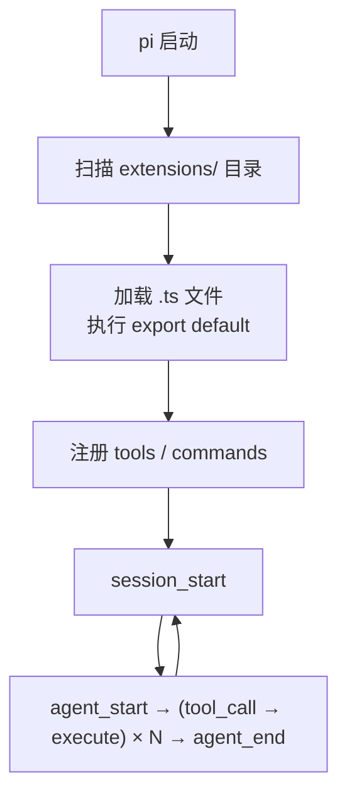

### 演示：回到 log-tools.ts（1 分钟）

讲师重新打开 `scripts/log-tools.ts`，从 Extension 视角重新审视：

- `export default function(pi)` — Extension 入口，pi 启动时自动调用
- `pi.registerTool({...})` — 注册工具到 Agent 的工具列表
- `pi.on("tool_call", ...)` — 拦截每次工具调用，做权限校验
- `onUpdate(...)` — 工具执行中推送进度到 UI

"这个 Extension 只有 50 行代码，但给 Agent 装上了一只新'手'——这就是 Extension 的能力。掌握了 ExtensionAPI，你可以在 Agent 上挂载任何自定义逻辑。"

---

< 衔接过渡 4 → 5 >

Tool 和 Extension 给了 Agent 执行能力。但还有一个根本问题：提示词本身的质量怎么保证？

---

## Part 5：提示词测试 — Promptfoo（6 分钟）

定位：把 TDD 理念带入提示词工程。定义"好"的标准，批量跑测试，数据驱动优化——在进入 Agent 之前，先掌握测试提示词的能力。

### 为什么需要测试提示词（1 分钟）

你写了一个提示词，改了改，怎么知道"改对了"？靠感觉？靠看一次输出？

提示词测试 = 单元测试 for LLM。你改代码不靠"看起来没问题"就上线——写好测试、跑通、提交。改提示词也一样：定义"正确输出"的标准，每次修改后自动验证。

### promptfoo 核心概念（2 分钟）

promptfoo 是开源的 LLM 提示词测试框架（MIT 协议，60K+ GitHub stars）。它把测试组织成一个配置文件：

```
promptfooconfig.yaml
├── prompts:    要测试的提示词（可多个版本对比）
├── providers:  用哪个模型跑（GPT-4o / Claude / Gemini / …）
└── tests:      测试用例 + 断言（输入 + 期望输出 + 通过标准）
```

**测试循环**：

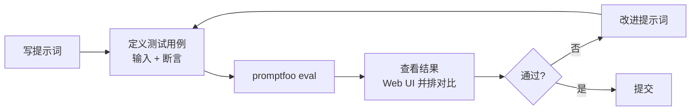

**过渡**：概念讲完了，直接用会场日志分析任务跑一遍。

### 实战演示（3 分钟）

用贯穿全场的 log 分析任务做演示。

**Step 1**：讲师展示 `scripts/promptfooconfig.yaml`：

```yaml
prompts:
  - "分析以下日志中的错误：{{log_content}}"                          # 版本 A：无角色
  - "你是资深 SRE。分析以下日志，以 JSON 输出错误列表。{{log_content}}"  # 版本 B：有角色+结构化

providers:
  - openai:gpt-4o

tests:
  - vars:
      log_content: |
        2026-05-24 10:23:15 ERROR DatabaseError: connection timeout
        2026-05-24 10:23:17 WARN  Retry failed
        2026-05-24 10:24:15 INFO  Connection pool restored
    assert:
      - type: contains-json
      - type: javascript
        value: JSON.parse(output).length >= 2  # 至少识别 ERROR 和 WARN

  - vars:
      log_content: |
        2026-05-24 10:23:45 ERROR InternalError: null value in column "user_id"
    assert:
      - type: icontains
        value: "null value"  # 必须指出具体错误
```

**Step 2**：终端运行 `promptfoo eval`，展示命令行输出——版本 A 通过率 0/2，版本 B 通过率 2/2。

**Step 3**：运行 `promptfoo view`，在浏览器中并排对比：
- 两个版本各自输出
- 通过/失败标记
- 延迟对比
- token 成本对比

**关键结论**：有了数据，你不需要"感觉"哪个提示词更好——promptfoo 直接告诉你。

---

**费曼检查**："promptfoo 的三个核心概念是什么？用大白话说。"（要测的提示词 + 用哪个模型 + 什么算对，讲师停顿 8 秒，学生自检）

---

< 衔接过渡 5 → 6 >

Tool 给 Agent 装上了手，promptfoo 让提示词可测试。但 Agent 还需要"知道怎么做"——这就是 Skill。

---

## Part 6：Skill 规范与原理（11 分钟）

定位：Skill 是 Agent 的"知识库"。合并 Part 2 技巧八的"封装复用"视角和 agentskill.io 规范，完整讲解 Skill 的设计、加载与生命周期。

### Skill vs Tool — 知识库 vs 执行器（2 分钟）

| | Tool | Skill |
|------|------|------|
| 作用 | 执行操作（读文件、运行命令） | 注入知识/流程（领域知识、工作流模板） |
| 注入位置 | 对话消息（tool result） | System Prompt |
| 触发方式 | LLM 输出 tool call | Agent 启动时自动加载 |
| 生命周期 | 按需调用，用完即弃 | 整个 session 常驻 |

### agentskill.io 规范 & 渐进式加载（3 分钟）

Skill 遵循 Agent Skills 开放标准（agentskill.io），核心设计是**渐进式加载**——三层结构让 Agent 管理几十上百个 Skill 而不会撑爆上下文。

已有示例 `skills/log-analyzer/` 的目录结构：

```
skills/log-analyzer/
├── SKILL.md              # 核心指令（YAML 头部 + Markdown 正文）
├── scripts/
│   └── parse_log.py      # 辅助脚本（按需执行）
└── references/
    └── log-patterns.md   # 参考知识（按需加载）
```

渐进式加载三层：
1. **metadata 层**（~100 tokens）：`name` + `description` — 常驻
2. **指令层**（500-5000 tokens）：完整 `SKILL.md` — 按需加载
3. **资源层**（按需）：`references/` — 需要时才加载

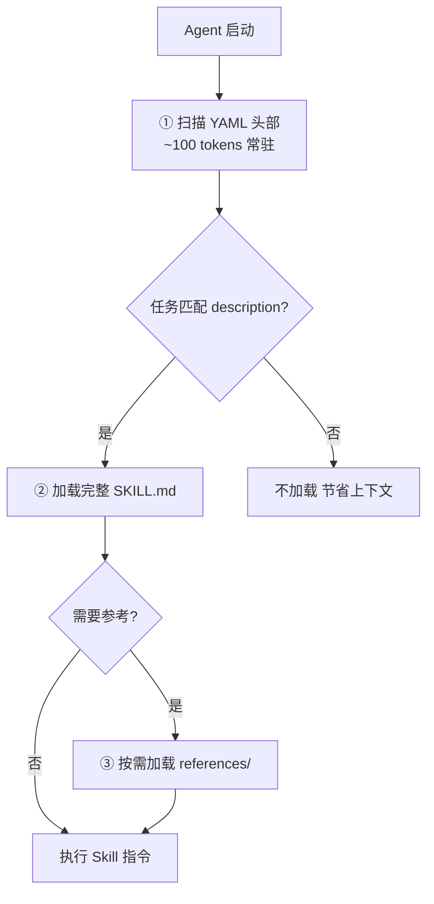

### 实战演示（2 分钟）

讲师在 pi 中演示 `skills/log-analyzer/SKILL.md` 的完整生命周期：
1. pi 启动 → 自动扫描 → available_skills 显示 `log-analyzer`
2. 输入"分析 sample.log 的错误根因"→ Agent 匹配 description → 自动加载
3. Agent 按 6 步流程执行 → 需要时按需加载 `references/log-patterns.md`

### 封装一个 Skill（1 分钟）

回到技巧八的核心洞察：把反复使用的提示词封装成 Skill，下次一键调用。`skills/log-analyzer/SKILL.md` 就是把 CoT 分析流程封装为可复用模板的例子。

---

**费曼检查**："Tool 和 Skill 有什么区别？用大白话说。"（Tool = 手，干活的。Skill = 说明书，告诉手怎么干。）

---

### Agent 的局限与边界（3 分钟）

Tool 和 Skill 给了 Agent 强大能力，但有边界。延续打车的比喻：大路司机认识，小路岔口仍需你指路。

**何时信任 Agent，何时介入**：

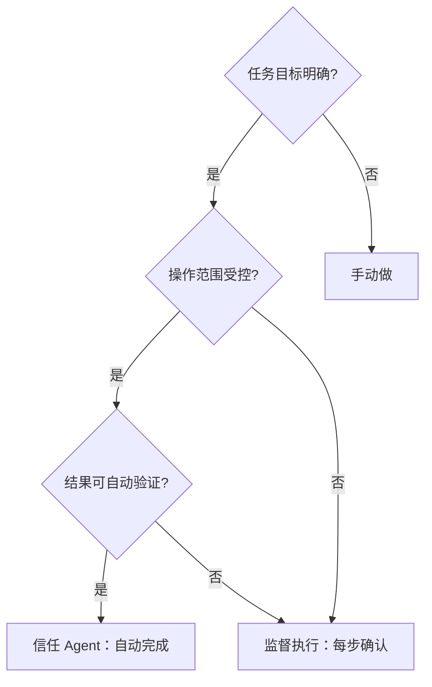

**三个安全原则**：
1. **不盲信**：Agent 输出和人类代码一样需要 review
2. **隔离环境**：用 git worktree / Docker 限制 Agent 操作范围
3. **可回滚**：所有修改都应可撤销（git commit 是最好的保险）

---

< 衔接过渡 6 → 7 >

现在提示词可测试、Tool 可调用、Skill 可复用——但 Agent 不是银弹。知道什么时候用它、什么时候自己动手，才是成熟的开发者。

现在提示词可以测试了（promptfoo），Tool 可以调用了，Skill 给 Agent 装上了知识库。把这三者组装起来——可测试的提示词 + 可调用的工具 + 可复用的知识 + 自动化的思考循环——这就是 Agent。

---

## Part 7：总结与收尾（5 分钟）

### 核心要点回顾（2 分钟）

三句话总结今天的内容：

1. **好提示词 = 清晰角色 + 结构化要求 + 示例**——输入质量决定输出质量
2. **进阶技巧让 AI 自己思考验证**——思维链（一步步推理）、ReAct（思考+行动+观察循环）、上下文管理（三层结构，超限压缩）
3. **Tool = Agent 的"手"**——Schema 定义接口、Execute 执行逻辑、Hook 控制权限。LLM 输出 tool call → Runtime 执行 → 结果回传
4. **Agent = 自动化的"思考→行动→观察"循环**——把前面所有技巧内化成了自动流程，你从操作者变成监督者

**过渡**：这三句话你现在可能觉得理所应当，但回想一下一小时前——你可能还在随便打字问 AI。这些技巧不需要你全部记住，挑一个明天就用的，先练起来。如果还想继续深入，这里有一些资源。

### 延伸学习资源（2 分钟）

- **pi agent**：`npm install -g @earendil-works/pi-coding-agent`，源码和文档在 [github.com/earendil-works/pi](https://github.com/earendil-works/pi)
- **提示词工程参考**：OpenAI Prompt Engineering Guide、Anthropic Prompt Library
- **Agent 进阶**：了解 pi agent 的多供应商架构（@earendil-works/pi-ai 支持 OpenAI、Anthropic、Google 等），探索 Agent 在多文件项目中的使用

**过渡**：资源大家回去慢慢看。最后我想留一个问题给大家——不是为了考试，是想让你们把今天的东西和工作真正连接起来。

### 讨论引导（1 分钟）

> 你日常开发中哪个环节最想先用 Agent 来提效？

（等待学员自愿分享，或讲师自答一个示例引导："比如我，每次搭新项目的脚手架最烦，下次试试让 Agent 帮我搞定。")

---

## 缓冲时间（2 分钟）

灵活用于超时、额外问答或延长的演示。

---

## 附录：关键概念速查

| 概念 | 一句话解释 | 类比 |
|------|-----------|------|
| 提示词工程 | 学会怎么跟 AI 说话 | GPS 导航 — 输入决定输出 |
| 角色设定 | 给 AI 一个身份 | 点菜前告诉厨师口味 |
| 明确指令 | 告诉 AI 要什么、不要什么 | API 参数 — 不说清楚拿不到结果 |
| Few-shot | 给 AI 看期望的输出样例 | 例子比文字描述更直接 |
| 结构化输出 | 让 AI 输出 JSON | 程序自动消费 |
| Pydantic AI | 代码定义 Schema，自动校验重试 | （见原理图） |
| 思维链 CoT | 写出推理过程，比只给答案可靠 | 数学老师批卷看过程 |
| ReAct | 思考→行动→观察→再思考 | Agent 的底层工作模式 |
| 上下文管理 | 三层结构 + 压缩机制 | 手机后台 — 开太多就清最早的 |
| Skill | 好提示词封装复用 | 一次封装，多次调用 |
| Agent | 自动化的"思考+行动+观察"循环 | 自驾 vs 打车 |
