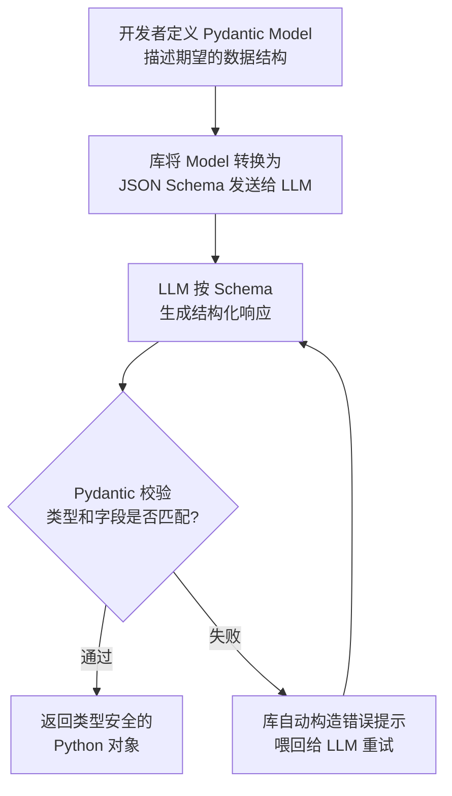
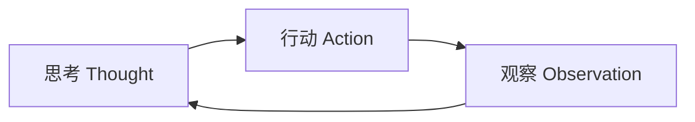
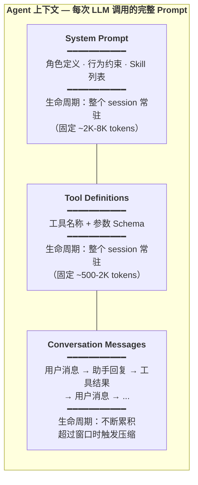
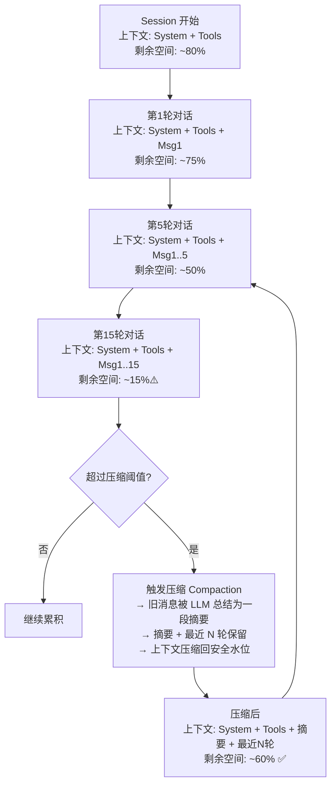
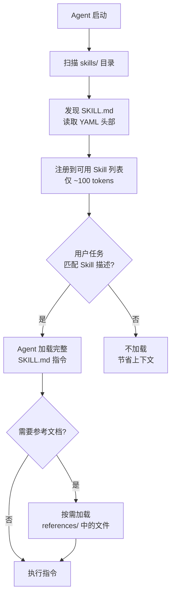
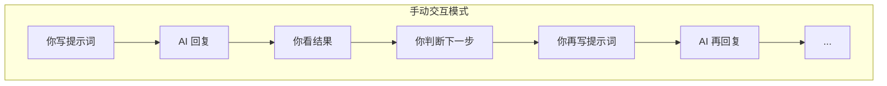
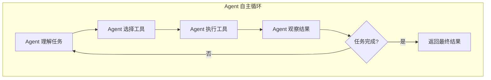
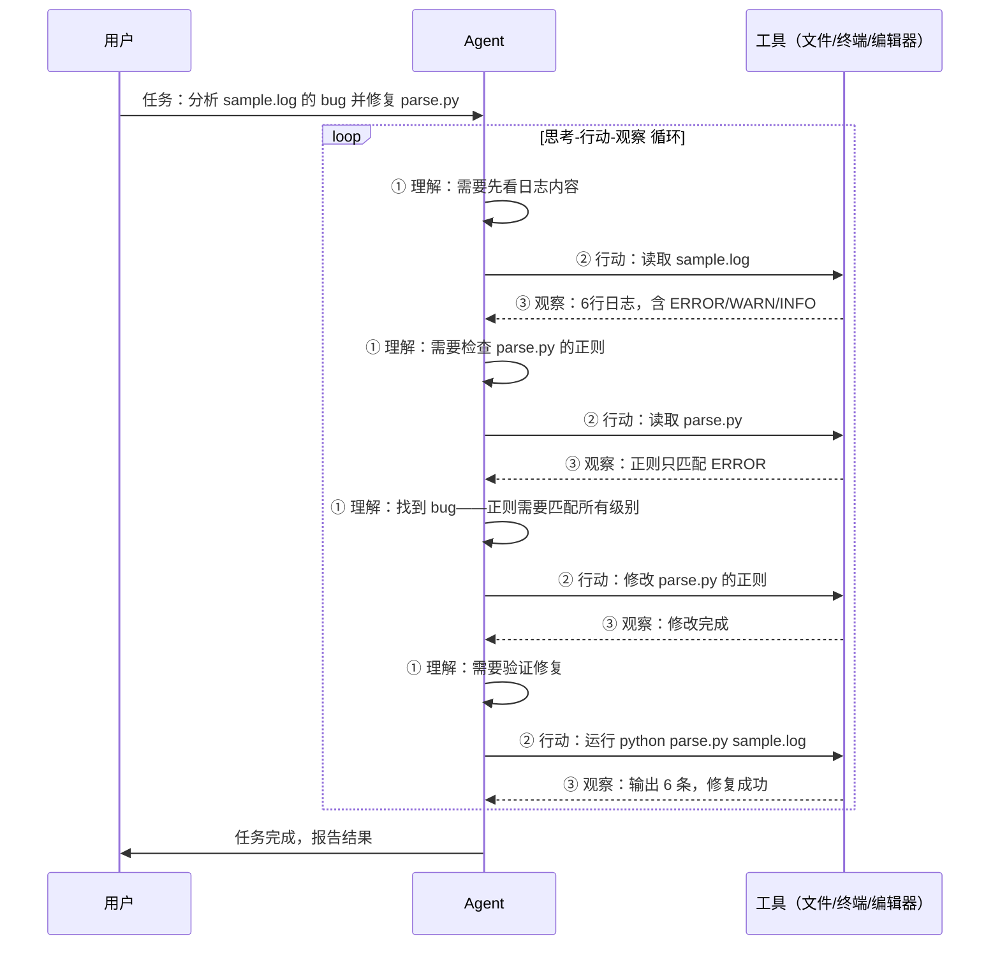
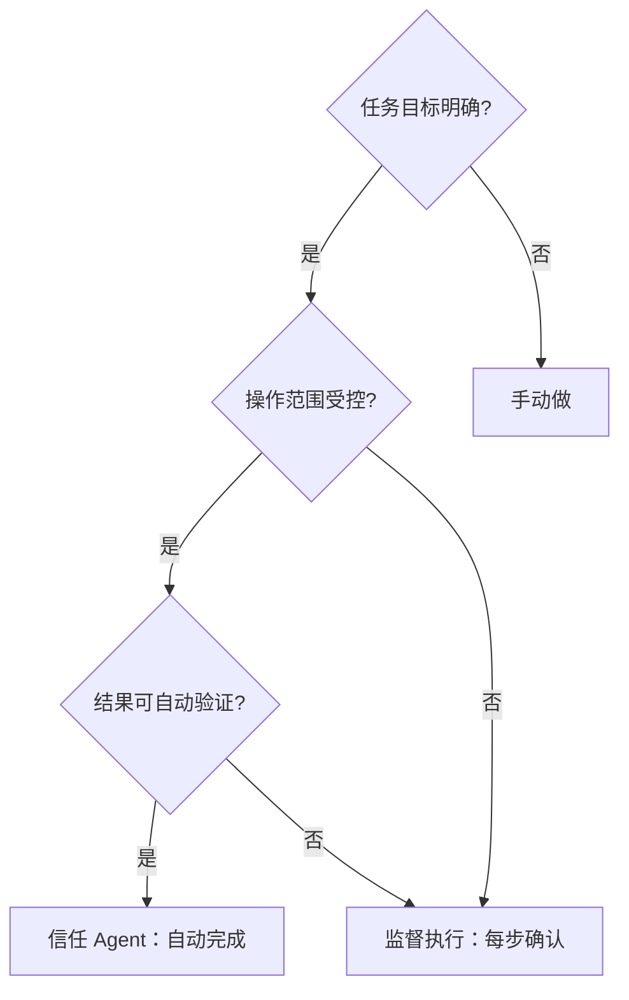

# 提示词工程与 Agent 入门 — 培训讲义

## 课程信息

- **时长**：60 分钟（55 分钟内容 + 5 分钟缓冲）
- **受众**：有编程经验的开发工程师
- **方法**：费曼学习法 — 用类比和实例解释每个概念
- **工具**：[pi agent](https://github.com/earendil-works/pi) — 开源编程 Agent CLI

## 演示场景

整场培训使用同一个 Python 日志解析任务贯穿。

**项目结构**：

```
demo-project/
├── parse.py          # 日志解析脚本（有 bug）
└── sample.log        # 测试日志文件
```

**`sample.log`**（6 行，含 ERROR、WARN、INFO）：

```
2026-05-24 10:23:15 ERROR DatabaseError: connection timeout after 30s
2026-05-24 10:23:16 ERROR DatabaseError: connection timeout after 30s
2026-05-24 10:23:17 WARN  Retry failed for transaction tx-9981
2026-05-24 10:23:45 ERROR InternalError: null value in column "user_id"
2026-05-24 10:24:01 ERROR DatabaseError: too many connections (current: 150, max: 150)
2026-05-24 10:24:15 INFO  Connection pool restored
```

**`parse.py`**（有 bug — 正则只匹配 ERROR，漏掉 WARN/INFO）：

```python
import sys
import re

def parse_log(filepath):
    errors = []
    with open(filepath) as f:
        for line in f:
            # BUG: 只匹配 ERROR，漏掉了 WARN 和其他级别
            match = re.match(r'(\d{4}-\d{2}-\d{2} \d{2}:\d{2}:\d{2}) ERROR (.+)', line)
            if match:
                errors.append({'time': match.group(1), 'msg': match.group(2)})
    return errors

if __name__ == '__main__':
    result = parse_log(sys.argv[1])
    print(f"Found {len(result)} errors")
    for e in result:
        print(f"  [{e['time']}] {e['msg']}")
```

运行 `python parse.py sample.log` 输出：

```
Found 4 errors          ← 实际有 6 行日志，只解析出 4 行
  [2026-05-24 10:23:15] DatabaseError: connection timeout after 30s
  [2026-05-24 10:23:16] DatabaseError: connection timeout after 30s
  [2026-05-24 10:23:45] InternalError: null value in column "user_id"
  [2026-05-24 10:24:01] DatabaseError: too many connections (current: 150, max: 150)
```

---

## 第一部分：开场与问题设定（5 分钟）

### 破冰（1 分钟）

> 你每天写代码，有多少时间花在非创造性的重复劳动上？查日志、找 bug、写样板代码、写文档……这些事情必须做，但不是你想做的。如果有一个工具能帮你分担这些，你会用吗？怎么用？

**过渡**：AI 工具可以帮你省下这些时间——但不是装上就能用好的。今天的目标就是让你学会怎么驾驭它。

### 课程目标（2 分钟）

学完这堂课，你能：

1. 写出高质量提示词，让 AI 更好帮你写代码
2. 理解 Agent 是什么、怎么工作的
3. 判断什么时候该用 Agent

**过渡**：空讲理论没意思，我们先花 30 秒看一眼——用今天要讲的工具 pi agent，它能帮我们做什么。

### 预告演示（2 分钟）

讲师在终端输入一个简单任务，pi agent 在 30 秒内完成分析并给出建议。学员看到：
- pi agent 能读文件、分析问题、给出修改建议
- 这个过程看起来"像魔法一样"

---

< 衔接过渡 1 → 2 >

刚才看了 pi agent 能做到多厉害的事，但关键问题来了——不是随便打几个字就能得到这种结果。提示词写得好不好，结果天差地别。我们先从最基础的技巧开始，看看怎么让 AI 听懂你的话。

---

## 第二部分：提示词工程 · 基础篇（15 分钟）

提示词工程的核心就一句话：**输入的质量决定输出的质量**。

### 什么是提示词工程（2 分钟）

提示词工程听起来高大上，其实就是**学会怎么跟 AI 说话**。

你对 AI 说"帮我改一下代码"——它猜。你说"分析 sample.log 中的 ERROR 行，按类型归类统计"——它直接给你结果。输入越精确，输出越靠谱；什么都不告诉它，它就瞎猜。

**过渡**：所以提示词工程听起来高大上，其实就是"学会怎么跟 AI 说话"。那我们从头开始——如果你只能做一件事来改进提示词，那就是告诉 AI 它是谁。

### 技巧一：角色设定（3 分钟）

告诉 AI 你是谁，它才知道怎么回答——就像点菜前告诉厨师你的口味，不说就只能吃默认的。

**演示**：讲师在 pi 中依次运行两个提示词，对比输出。

| 回合 | 提示词 | 效果 |
|------|--------|------|
| 无角色 | "分析 sample.log" | AI 泛泛回答，不知道分析什么维度 |
| 有角色 | "你是一个资深 Python 后端开发，负责日志分析。请分析 sample.log" | AI 开始从开发者视角分析，提到正则匹配、异常归类等 |

**过渡**：角色设定让 AI 知道了"我是谁"，但光有身份还不够——你还得告诉它"我要什么、不要什么"。

### 技巧二：明确指令与约束（3 分钟）


**演示**：对比模糊指令和精确指令。

| 回合 | 提示词 | 效果 |
|------|--------|------|
| 模糊 | "帮我分析这个日志文件" | AI 输出一段自由文本，格式随意 |
| 精确 | "分析 sample.log，按错误类型分组，统计每种错误出现次数，按次数降序排列" | AI 给出结构化清晰的分析 |

**过渡**：精确指令能让 AI 不跑偏，但有些东西——比如你想要的代码风格、分析深度——很难用一句话描述清楚。最直接的办法：给个参考答案。

### 技巧三：Few-shot 示例（4 分钟）

给一两个输入→输出的例子，AI 就能照猫画虎。比写 100 字描述更管用。

**演示**：0-shot vs 2-shot 对比。

| 回合 | 提示词 | 效果 |
|------|--------|------|
| 0-shot | "把 sample.log 中的错误信息提取出来" | AI 自由发挥，格式不确定 |
| 2-shot | "示例输入：`ERROR timeout` → 输出：`{级别:ERROR, 原因:timeout, 建议:检查连接池}`。示例输入：`ERROR null value` → 输出：`{级别:ERROR, 原因:null_value, 建议:加非空校验}`。现在分析 sample.log 中所有的行。" | AI 严格遵循给定的输出格式 |

**过渡**：现在 AI 的输出质量已经很好了，但这是面向人读的。如果你想把 AI 的输出接入自动化流程，需要的不是一段优美的散文，而是机器能解析的结果。

### 技巧四：结构化输出（3 分钟）


**演示（1.5 分钟）**：对比无格式约束和 JSON 约束。

| 回合 | 提示词 | 效果 |
|------|--------|------|
| 自由文本 | "分析 sample.log 的错误" | AI 输出散文，无法程序化解析 |
| JSON 约束 | "分析 sample.log，以 JSON 格式输出：`[{level, message, count}]`，只输出 JSON，不要其他文字" | AI 输出纯 JSON，可直接被程序消费 |

但仅仅 "prompt 里要求输出 JSON" 有个问题——AI 偶尔会输出格式错误的数据（多一个逗号、少一个引号），你的程序就会崩溃。

**Pydantic AI 方案（1.5 分钟）**：用代码定义数据结构，让库自动处理校验和重试。

```python
# 1. 用 Pydantic 定义你期望的数据结构
from pydantic import BaseModel

class LogEntry(BaseModel):
    time: str
    level: str
    message: str

class LogAnalysis(BaseModel):
    entries: list[LogEntry]
    total_errors: int
    summary: str

# 2. 把 Model 交给 LLM，库自动处理校验和重试
# AI 返回的数据会自动校验类型
# 如果格式不对，库会自动把错误信息喂给 LLM 重试
result = agent.run_sync(
    "分析 sample.log",
    result_type=LogAnalysis  # ← 这就是你要的"表单"
)
# result 是类型安全的 Python 对象，不是字符串
```

**Pydantic AI 原理**：



**对比两种方式**：

| 方式 | 可靠性 | 使用场景 |
|------|--------|---------|
| Prompt 约束 JSON | 依赖 LLM 输出质量，偶有格式错误 | 快速原型、一次性脚本 |
| Pydantic AI（代码定义 Schema） | 自动校验 + 重试，类型安全 | 生产环境、自动化流水线 |

---

**费曼检查**："你同事发了一条提示词，AI 回复很烂。你加上一句话——'你是一个资深 Python 后端开发'——AI 的回复立刻好了。为什么这一句话有这么大作用？用你自己的话解释。"（讲师停顿 8 秒，不点名，学生自检）

---

< 衔接过渡 2 → 3 >

到目前为止，我们学的都是"一轮对话"的技巧——你写好提示词，AI 给你答案。但现实中复杂的开发问题不是一问一答能搞定的。接下来我们升级一下：怎么让 AI 自己先想清楚再回答，甚至自己去验证答案对不对。

---

## 第三部分：提示词工程 · 进阶篇（15 分钟）

**叙事线**：让 AI 学会先思考再回答。

### 技巧五：思维链（Chain of Thought, CoT）（4 分钟）


**演示**：直接要答案 vs 分步推理。

| 回合 | 提示词 | 效果 |
|------|--------|------|
| 直接回答 | "parse.py 有什么 bug？" | AI 可能猜对也可能猜错 |
| CoT | "请逐步分析：① 先看 sample.log 里有什么 ② 再看 parse.py 的代码逻辑 ③ 对比预期行为和实际行为 ④ 描述 bug" | AI 分步推理，结论有据可查 |

**过渡**：思维链是让 AI 在脑子里多转几圈。但真正的开发场景里，光想不够——AI 需要动手做事：运行命令、读文件、看报错，然后根据实际结果调整。这个"思考 + 行动 + 观察 + 再思考"的循环，就是 ReAct 模式——它也是后面要讲的 Agent 的核心机制。

### 技巧六：ReAct 模式（4 分钟）

ReAct = 思考→行动→观察→再思考。这个循环是所有 AI Agent 的底层工作方式。

**ReAct 循环示意**：



**演示**：手动构造一个 ReAct 风格的多轮对话，展示每一步。

```
提示词："我们来排查 parse.py 的 bug。每轮你只做一件事：①思考下一步做什么 ②执行 ③观察结果 ④决定是否继续"

第1轮：
  思考："先运行 parse.py 看它的输出"
  行动：运行 python parse.py sample.log
  观察：只输出了 4 条错误，但日志有 6 行

第2轮：
  思考："它漏掉了 WARN 和 INFO 行。需要看 parse.py 的代码逻辑"
  行动：读取 parse.py
  观察：正则只匹配了 'ERROR'，没有匹配 WARN 和 INFO
```

**过渡**：ReAct 模式好是好，但每轮都带着前面所有的上下文——对话越长，占用的 token 越多。AI 有上下文窗口的限制。

### 技巧七：Agent 上下文组成与生命周期（3 分钟）

对话越长，早期内容越可能被"清理"——像手机后台，开太多最早的就杀了。但 System Prompt 是系统进程，永不清理。关键信息放这里。

**Agent 的上下文由三部分组成**：



**每部分的生命周期详解**：

| 部分 | 何时加载 | 何时失效 | Token 占比 | 管理策略 |
|------|---------|---------|-----------|---------|
| **System Prompt** | Session 开始时注入 | Session 结束 | ~15-30%（固定） | 尽量精简，关键信息前置 |
| **Tool Definitions** | Session 开始时注入 | Session 结束 | ~5-10%（固定） | 只给必要的工具，避免工具爆炸 |
| **Messages（对话记录）** | 每轮对话追加 | 超过窗口时压缩 | 剩余空间全部 | 旧消息→压缩摘要，思考块→可丢弃 |

**对话消息的累积与压缩**：



**压缩（Compaction）的机制**：

当上下文 tokens 超过 `模型窗口 - 预留空间`（pi 默认预留 16K tokens）时触发：

1. **选择切割点**：保留最近 ~20K tokens 的对话，更早的进入压缩区
2. **生成摘要**：用一个轻量模型调用，把旧对话压缩成结构化摘要（目标、进度、决策、下一步）
3. **替换历史**：摘要替代原始对话进入上下文，tokens 从几千缩到几百
4. **迭代更新**：后续再触发压缩时，在已有摘要基础上更新，而非重新总结全部历史

**核心原则**：

- **关键信息放 System Prompt**：它永远不被压缩，是最安全的位置
- **长对话信任摘要**：压缩后的摘要虽不完美，但比"AI 忘了前面说过什么"要好得多
- **工具输出精简**：工具返回结果尽量只保留关键部分，别把 10MB 日志全塞进上下文

**过渡**：现在你的工具箱里已经有好几件利器了——CoT、ReAct、上下文管理。但每次用的时候都重新敲一遍提示词太傻了。程序员的本能反应是什么？封装复用。

### 技巧八：提示词模板化与复用 — Skill（4 分钟）

把反复使用的好提示词封装成 Skill，下次一键调用，不再重复敲。

你刚刚手动做的这个 CoT 分析流程——先看日志、再读源码、对比差异、定位根因——如果每次都要重新敲一遍提示词，太麻烦了。你可以把它封装成一个 **Skill**。

**什么是 Skill**：Skill 是 Agent Skills 开放标准（agentskill.io）定义的可复用提示词模板。一个 Skill 就是一个目录，里面有 `SKILL.md`（核心指令），还可以有辅助脚本和参考文档。Agent 启动时自动发现 Skill，使用时按需加载。

**Skill 的目录结构**：

```
skills/log-analyzer/
├── SKILL.md              # 核心：YAML 头部 + Markdown 指令
├── scripts/
│   └── parse_log.py      # 辅助脚本
└── references/
    └── log-patterns.md   # 参考知识（常见日志模式）
```

**SKILL.md 的核心要素**：

```yaml
---
name: log-analyzer
description: 分析日志文件，找出错误根因并给出修复建议。
             当用户提到"日志分析"、"找 bug"时使用。
---

# 日志分析器

## 分析流程
### 第1步：理解数据 — 读取日志，统计级别分布
### 第2步：阅读源码 — 理解代码的解析逻辑
### 第3步：对比分析 — 日志实际内容 vs 代码预期行为
### 第4步：定位根因 — 找到不匹配的具体代码行
### 第5步：修复建议 — 给出具体修改方案
### 第6步：验证修复 — 运行并确认
```

**演示**：讲师在编辑器中打开 `skills/log-analyzer/SKILL.md`，展示完整的 Skill 文件。强调：

- YAML 头部（name + description）让 Agent 自动发现这个 Skill
- 6 步分析流程把 CoT 模式封装成了可复用的模板
- `references/log-patterns.md` 是辅助知识库，按需加载
- 这个 Skill 可以在 Claude Code、Gemini CLI、Cursor、GitHub Copilot 等 40+ 平台通用

**Skill 加载机制**（展示 Mermaid 图）：



这就是**渐进式加载**（Progressive Disclosure）——Skill 的 metadata（~100 tokens）常驻，完整指令（<5000 tokens）按需加载，参考文件进一步按需加载。上下文效率最大化。

---

**费曼检查**："你要用 ReAct 模式教 AI 排查一个 bug——它会先做什么？然后做什么？最后怎么知道做完了？不用术语，用大白话说出这三步。"（讲师停顿 8 秒，学生自检。三步 = 先观察数据 → 再行动验证 → 看结果判断是否继续）

---

< 衔接过渡 3 → 4 >

回顾一下我们现在做的事：写好提示词 → 看 AI 输出 → 判断结果行不行 → 不行就改提示词再来 → 再看输出……每一步都是你手动操作。有没有一种东西，能自动完成这个循环？它自己思考、自己调用工具、自己看结果、自己决定下一步？这个东西就叫 Agent。前面的所有技巧——角色设定、结构化输出、CoT、ReAct——其实都在为这一刻铺垫。

---

## 第四部分：Agent 入门（15 分钟）

### 什么是 Agent（3 分钟）

**类比**：自驾 vs 打车。

- **提示词工程**：你开车。方向盘、油门、刹车、看路况——每一步都要你自己操作。想去哪、走哪条路、要不要变道，全你决定。
- **Agent**：你打车。告诉司机目的地，然后你可以看风景、回消息。但你得偶尔确认司机没走错路——尤其在接近目的地的小路岔口。

**动手交互 vs Agent 自主循环**：





**过渡**：Agent 听起来神秘，但拆开看核心就是一个简单的四步循环——和我们刚才手动做的 ReAct 几乎一模一样，只是现在 AI 自己来驱动这个循环了。

### Agent 核心循环拆解（4 分钟）

每一步用大白话解释，结合 pi agent 的实际执行日志讲解。



**四步拆解**：

1. **理解任务**：Agent 解读用户目标，拆解为子任务
2. **选择工具**：Agent 决定用什么工具（读文件、运行命令、搜索代码……）
3. **执行工具**：Agent 实际调用工具
4. **观察结果**：Agent 分析工具输出，判断是否需要继续

**过渡**：理论讲完了，我们来看一个真实的例子——用 pi agent 从头到尾完成一个开发任务。注意观察：Agent 在每一步是怎么思考、怎么选工具、怎么根据结果调整的。

### 端到端演示（5 分钟）

任务：分析 sample.log → 定位 parse.py 的 bug → 修改代码 → 验证修复。

**演示策略**：提前执行一次该任务并保存 session 日志，现场以回放关键步骤 + 讲师实时讲解的方式呈现，避免 Agent 实时执行时间不可控导致超时。

**讲师讲解要点**（配合回放逐步展示）：

| 阶段 | Agent 行为 | 讲师点评 |
|------|-----------|---------|
| 读取日志 | Agent 自动读取 `sample.log`（使用 read_file 工具或 shell 命令） | "注意——我们没有告诉它 '先用 cat 看日志'，它自己知道要先看数据" |
| 分析代码 | Agent 读取 parse.py | "它发现日志有 6 行但输出只有 4 行，怀疑代码有问题，自己去读了源码" |
| 定位 bug | Agent 指出正则只匹配 ERROR | "它就和你刚才手动分析时得到的结论一样——但这次你没有写任何提示词" |
| 修改代码 | Agent 用编辑工具修改正则 | "它把 `ERROR` 改成了 `\w+`，匹配所有日志级别" |
| 验证修复 | Agent 运行 `python parse.py sample.log` | "它改完代码后自动运行验证——你不需要说 '改完验证一下'" |

**过渡**：刚才的演示看起来很流畅，但说实话，Agent 不是每次都这么顺利。就像打车——大路司机认识，但小路的岔口可能需要你指路。我们来聊聊 Agent 的边界在哪里。

### Agent 的局限与边界（3 分钟）

延续打车的比喻：大路司机认识，小路岔口仍需你指路。通用任务 Agent 很稳，项目特有的编码规范、业务逻辑仍需你介入。

**何时该信任 Agent，何时该介入**：



**三个安全原则**：

1. **不盲信**：Agent 的输出和人类代码一样需要 review
2. **隔离环境**：让 Agent 在受限环境中操作（如 git worktree、Docker），避免误删文件
3. **可回滚**：Agent 的所有修改都应可撤销（git commit 是最好的保险）

---

**费曼检查**："一小时前，你手动写提示词让 AI 分析日志。现在，Agent 自动完成了同样的事。从'手动操作'到'自动完成'，核心变化是什么？用你自己的话说，不要用术语。"（讲师停顿 10 秒，学生自检。核心变化 = AI 自己驱动了'思考→行动→观察'循环，你从操作者变成了监督者）

---

< 衔接过渡 4 → 5 >

我们从"怎么写好一句话"开始，一路走到了"怎么让 AI 自己完成整个任务"。让我们退一步，回顾一下这一小时我们学到了什么，更重要的是——明天上班你能立刻用上什么。

---

## 第五部分：总结与收尾（5 分钟）

### 核心要点回顾（2 分钟）

三句话总结今天的内容：

1. **好提示词 = 清晰角色 + 结构化要求 + 示例**——输入质量决定输出质量
2. **进阶技巧让 AI 自己思考验证**——思维链（一步步推理）、ReAct（思考+行动+观察循环）、上下文管理（关键信息前置）
3. **Agent = 自动化的"思考→行动→观察"循环**——它把前面所有技巧内化成了自动流程，你只需要描述目标

**过渡**：这三句话你现在可能觉得理所应当，但回想一下一小时前——你可能还在随便打字问 AI。这些技巧不需要你全部记住，挑一个明天就用的，先练起来。如果还想继续深入，这里有一些资源。

### 延伸学习资源（2 分钟）

- **pi agent**：`npm install -g @earendil-works/pi-coding-agent`，源码和文档在 [github.com/earendil-works/pi](https://github.com/earendil-works/pi)
- **提示词工程参考**：OpenAI Prompt Engineering Guide、Anthropic Prompt Library
- **Agent 进阶**：了解 pi agent 的多供应商架构（@earendil-works/pi-ai 支持 OpenAI、Anthropic、Google 等），探索 Agent 在多文件项目中的使用

**过渡**：资源大家回去慢慢看。最后我想留一个问题给大家——不是为了考试，是想让你们把今天的东西和工作真正连接起来。

### 讨论引导（1 分钟）

> 你日常开发中哪个环节最想先用 Agent 来提效？

（等待学员自愿分享，或讲师自答一个示例引导："比如我，每次搭新项目的脚手架最烦，下次试试让 Agent 帮我搞定。")

---

## 缓冲时间（5 分钟）

灵活用于超时、额外问答或延长的演示。

---

## 附录：关键概念速查

| 概念 | 一句话解释 | 类比 |
|------|-----------|------|
| 提示词工程 | 学会怎么跟 AI 说话 | GPS 导航 — 输入决定输出 |
| 角色设定 | 给 AI 一个身份 | 点菜前告诉厨师口味 |
| 明确指令 | 告诉 AI 要什么、不要什么 | API 参数 — 不说清楚拿不到结果 |
| Few-shot | 给 AI 看期望的输出样例 | 例子比文字描述更直接 |
| 结构化输出 | 让 AI 输出 JSON | 程序自动消费 |
| Pydantic AI | 代码定义 Schema，自动校验重试 | （见原理图） |
| 思维链 CoT | 写出推理过程，比只给答案可靠 | 数学老师批卷看过程 |
| ReAct | 思考→行动→观察→再思考 | Agent 的底层工作模式 |
| 上下文管理 | 三层结构 + 压缩机制 | 手机后台 — 开太多就清最早的 |
| Skill | 好提示词封装复用 | 一次封装，多次调用 |
| Agent | 自动化的"思考+行动+观察"循环 | 自驾 vs 打车 |
